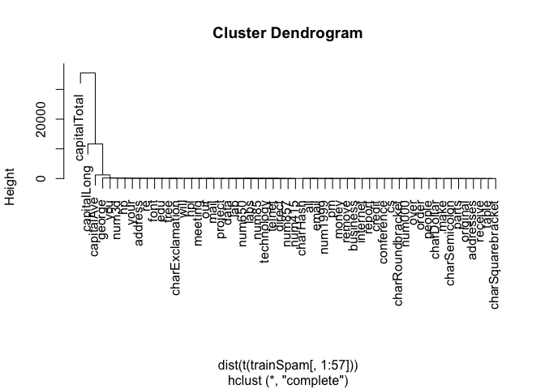

Reproducible Research
================
tedding
April 12, 2016

Structure of a Data Analysis
============================

steps in a data analysis
------------------------

Define the question
Define the ideal data set
Determine what data you can access
Obtain the data
Clean the data
Exploratory data analysis
Statistical prediction/modeling
Interpret results
Challenge results
Synthesize/ write up results
Create reporducible code

What to Do and What Not to Do
-----------------------------

DO : Keep track of your software environment

``` r
sessionInfo()
```

    ## R version 3.2.3 (2015-12-10)
    ## Platform: x86_64-apple-darwin13.4.0 (64-bit)
    ## Running under: OS X 10.12.6 (unknown)
    ## 
    ## locale:
    ## [1] zh_CN.UTF-8/zh_CN.UTF-8/zh_CN.UTF-8/C/zh_CN.UTF-8/zh_CN.UTF-8
    ## 
    ## attached base packages:
    ## [1] stats     graphics  grDevices utils     datasets  methods   base     
    ## 
    ## loaded via a namespace (and not attached):
    ##  [1] backports_1.0.5 magrittr_1.5    rprojroot_1.2   tools_3.2.3    
    ##  [5] htmltools_0.3.5 yaml_2.1.14     Rcpp_0.12.10    stringi_1.1.5  
    ##  [9] rmarkdown_1.6   knitr_1.15.1    stringr_1.2.0   digest_0.6.12  
    ## [13] evaluate_0.10

DON'T : only save the output, save data(data production flow) + code as well
DO : set your seed, set.seed()
DO : think about the entire pipeline

-   raw data -&gt; processed data -&gt; analysis -&gt; report
-   the more data analysis pipeline you make, the better for everyone

Exploratory data analysis
-------------------------

``` r
library(kernlab)
data(spam)
set.seed(3435)
trainIndicator = rbinom( 4601, size = 1, prob = 0.5)
table(trainIndicator)
```

    ## trainIndicator
    ##    0    1 
    ## 2314 2287

``` r
trainSpam = spam[ trainIndicator ==1, ]
testSpam = spam[ trainIndicator == 0, ]
# summarys, missing data, exploratory plots, clusting...
head(trainSpam)
```

    ##    make address  all num3d  our over remove internet order mail receive
    ## 1  0.00    0.64 0.64     0 0.32 0.00   0.00        0  0.00 0.00    0.00
    ## 7  0.00    0.00 0.00     0 1.92 0.00   0.00        0  0.00 0.64    0.96
    ## 9  0.15    0.00 0.46     0 0.61 0.00   0.30        0  0.92 0.76    0.76
    ## 12 0.00    0.00 0.25     0 0.38 0.25   0.25        0  0.00 0.00    0.12
    ## 14 0.00    0.00 0.00     0 0.90 0.00   0.90        0  0.00 0.90    0.90
    ## 16 0.00    0.42 0.42     0 1.27 0.00   0.42        0  0.00 1.27    0.00
    ##    will people report addresses free business email  you credit your font
    ## 1  0.64   0.00      0         0 0.32        0  1.29 1.93   0.00 0.96    0
    ## 7  1.28   0.00      0         0 0.96        0  0.32 3.85   0.00 0.64    0
    ## 9  0.92   0.00      0         0 0.00        0  0.15 1.23   3.53 2.00    0
    ## 12 0.12   0.12      0         0 0.00        0  0.00 1.16   0.00 0.77    0
    ## 14 0.00   0.90      0         0 0.00        0  0.00 2.72   0.00 0.90    0
    ## 16 0.00   0.00      0         0 1.27        0  0.00 1.70   0.42 1.27    0
    ##    num000 money hp hpl george num650 lab labs telnet num857 data num415
    ## 1       0  0.00  0   0      0      0   0    0      0      0 0.00      0
    ## 7       0  0.00  0   0      0      0   0    0      0      0 0.00      0
    ## 9       0  0.15  0   0      0      0   0    0      0      0 0.15      0
    ## 12      0  0.00  0   0      0      0   0    0      0      0 0.00      0
    ## 14      0  0.00  0   0      0      0   0    0      0      0 0.00      0
    ## 16      0  0.42  0   0      0      0   0    0      0      0 0.00      0
    ##    num85 technology num1999 parts pm direct cs meeting original project re
    ## 1      0          0    0.00     0  0   0.00  0       0      0.0       0  0
    ## 7      0          0    0.00     0  0   0.00  0       0      0.0       0  0
    ## 9      0          0    0.00     0  0   0.00  0       0      0.3       0  0
    ## 12     0          0    0.00     0  0   0.00  0       0      0.0       0  0
    ## 14     0          0    0.00     0  0   0.00  0       0      0.0       0  0
    ## 16     0          0    1.27     0  0   0.42  0       0      0.0       0  0
    ##    edu table conference charSemicolon charRoundbracket charSquarebracket
    ## 1    0     0          0         0.000            0.000                 0
    ## 7    0     0          0         0.000            0.054                 0
    ## 9    0     0          0         0.000            0.271                 0
    ## 12   0     0          0         0.022            0.044                 0
    ## 14   0     0          0         0.000            0.000                 0
    ## 16   0     0          0         0.000            0.063                 0
    ##    charExclamation charDollar charHash capitalAve capitalLong capitalTotal
    ## 1            0.778      0.000    0.000      3.756          61          278
    ## 7            0.164      0.054    0.000      1.671           4          112
    ## 9            0.181      0.203    0.022      9.744         445         1257
    ## 12           0.663      0.000    0.000      1.243          11          184
    ## 14           0.000      0.000    0.000      2.083           7           25
    ## 16           0.572      0.063    0.000      5.659          55          249
    ##    type
    ## 1  spam
    ## 7  spam
    ## 9  spam
    ## 12 spam
    ## 14 spam
    ## 16 spam

``` r
plot( trainSpam$capitalAve ~ trainSpam$type )
```


``` r
plot( log10(trainSpam$capitalAve +1) ~ trainSpam$type ) # how to show data
```


``` r
plot( log10(trainSpam[,1:4]+1))
```


``` r
hCluster = hclust( dist(t(trainSpam[, 1:57])))
plot(hCluster)
```



``` r
# statistical prediction / modeling
trainSpam$numType = as.numeric( trainSpam$type) -1 
costFunction = function(x,y) sum( x!= (y>0.5))
cvError = rep(NA, 55)
library(boot)
for ( i in 1:55) {
  lmFormula = reformulate( names(trainSpam)[i], response = "numType")
  glmFit = glm( lmFormula, family = "binomial", data = trainSpam )
  cvError[i] = cv.glm( trainSpam, glmFit, costFunction, 2)$delta[2]
}

## which predictor has minimum cross-validated error?
names(trainSpam)[ which.min(cvError)]
```

    ## [1] "charDollar"

``` r
## use the best model for the group
predictionModel = glm( numType ~ charDollar, family = "binomial", data = trainSpam )

## Get predictions on the test set
predictionTest = predict( predictionModel, testSpam)
predictedSpam = rep("nonspam", dim(testSpam)[1])

## classify as 'spam' for those with prob > 0.5
predictedSpam[ predictionModel$fitted > 0.5] = "spam"
##classification table
table( predictedSpam, testSpam$type)
```

    ##              
    ## predictedSpam nonspam spam
    ##       nonspam    1346  458
    ##       spam         61  449

Organizing Your Analysis
========================

Data: raw / precessed
Figures:
<t>exploratory( do not need to be pretty)
<t>final( usually a small subse of original figs; axes,colors to make it clear)
R code: raw / final / markdown
test: read me / report

ref
===

-   cheatsheet of rmarkdown
