base plot
================
Dingchong
Friday, September 26, 2014

Abstract
========

Update: 2015-03-22
Purpose:
讨论常见图形的命令、参数和效果，尽量用R基础功能实现，效果不输excel
Data Used: iris, VADeaths...
Packages Used: MASS,RColorBrewer

单变量的频数
============

单变量的条形图
--------------

``` r
barplot( airquality$Temp[ airquality$Month ==5 ] ) # 全月温度，其实barplot不合适
```

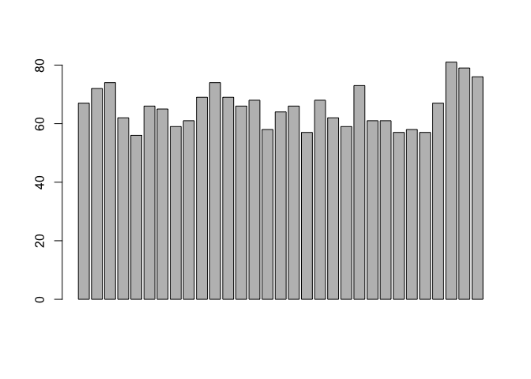

``` r
barplot(  airquality$Temp[ airquality$Month ==5 ], horiz =T ) # 调过来
```

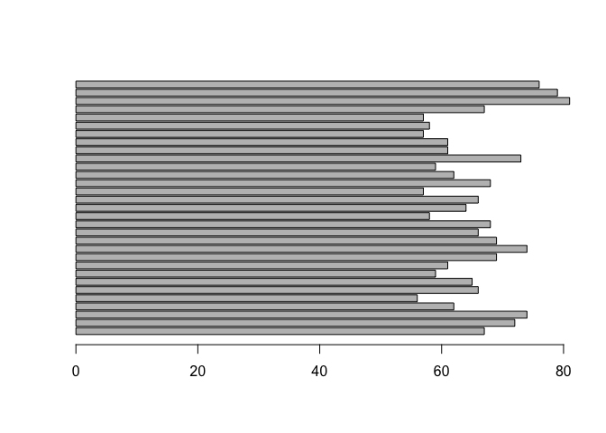

``` r
barplot(  airquality$Temp[ airquality$Month ==5 ], width = c(1,2) )  # 箱体宽度
```

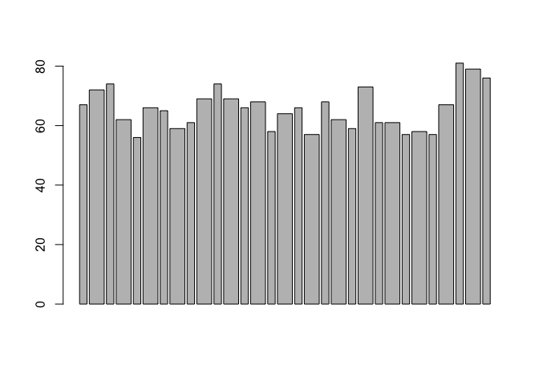

``` r
barplot(  airquality$Temp[ airquality$Month ==5 ],border = "red" ,col = 'white')  # 颜色
```

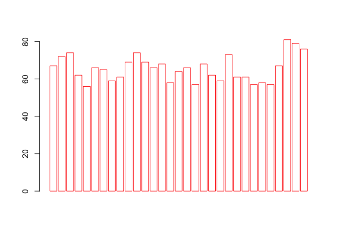

基于plot的展示方式
------------------

``` r
plot(  airquality$Temp[ airquality$Month ==5 ], type = 'h')
```

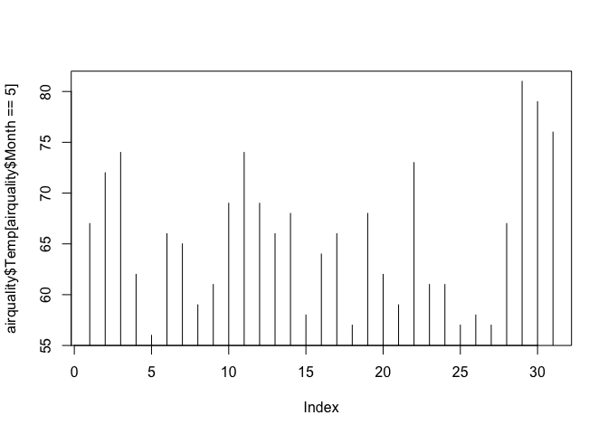

饼图
----

``` r
# Pie Chart with Percentages
slices <- c(10, 12, 4, 16, 8) 
lbl <- c("US", "UK", "Australia", "Germany", "France")
pct <- round(slices/sum(slices)*100)
lbls <- paste(lbl, pct, "%", sep = " ") # add percents to labels 
pie(slices,labels = lbls, col=rainbow(length(lbls)),
    main="Pie Chart of Countries")
```

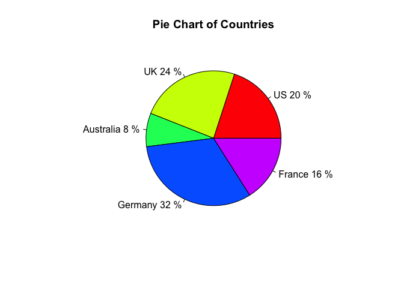

直方图
------

``` r
x <- mtcars$mpg

# 频数分布
h<-hist(x, breaks=10, col="red", xlab="Miles Per Gallon", 
        prob=F , # prob = T 为密度曲线
        main="Histogram with Normal Curve") 
# 添加拟合曲线
xfit<-seq(min(x),max(x),length=40) 
yfit<-dnorm(xfit,mean=mean(x),sd=sd(x)) # 正态分布可以这么画，其他分布参考分布函数
yfit <- yfit*diff(h$mids[1:2])*length(x) 
lines(xfit, yfit, col="blue", lwd=2)
```

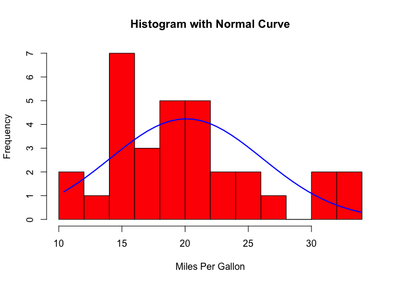

``` r
# 累计分布函数
plot(ecdf(x),verticals = TRUE, do.p = FALSE) 
lines(x, pnorm(x, mean(x), sd(x)), col = "red")
```

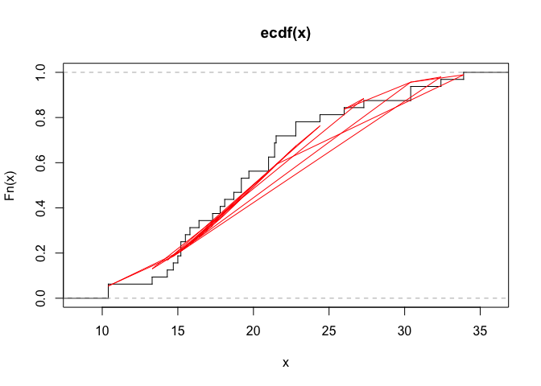

``` r
# QQ图
qqnorm(x); qqline(x, col = "red")
```

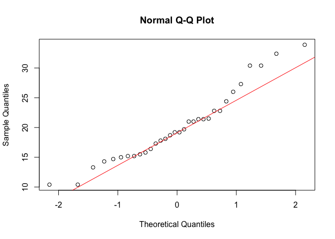

多变量之间的关系
================

箱线图：连续变量VS离散变量
--------------------------

``` r
boxplot( Petal.Length ~ Species , data = iris , outline = F  ) # 离群值不显示
```

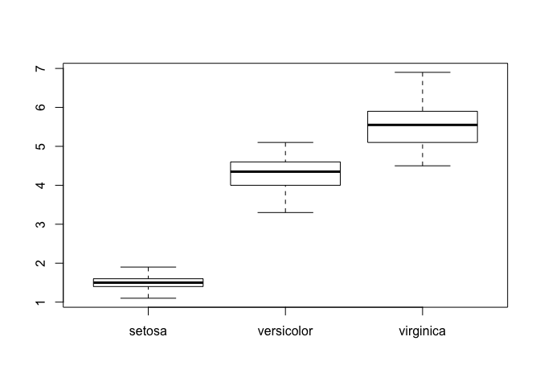

``` r
boxplot( mpg ~ cyl * gear, data = mtcars , varwidth=T , # 箱体宽度由样本量决定
  xlab = "cyl (4-8) * gear (3-5)" )
```


条形图：连续变量的分组（连续\*离散）条形图
------------------------------------------

``` r
# 统计汇总条形图
l <- aggregate( Sepal.Length ~ Species, data= iris, mean)
l # 数据是这样的
```

    ##      Species Sepal.Length
    ## 1     setosa        5.006
    ## 2 versicolor        5.936
    ## 3  virginica        6.588

``` r
x <- barplot( l[,2] ,  col=terrain.colors(3) , 
      xlim=c(0,5), ylim=c(0,8) ,axe=F, names.arg = l[,1] )
y <- as.matrix( l[,2] )
text( x, y+1, labels=l[,2], col="black" ) 
#柱顶标注，y +n调节标注高度，横放图则调x+n
legend(legend=l[,1], "right", pch=15, col=terrain.colors(3) ) # 图例
```

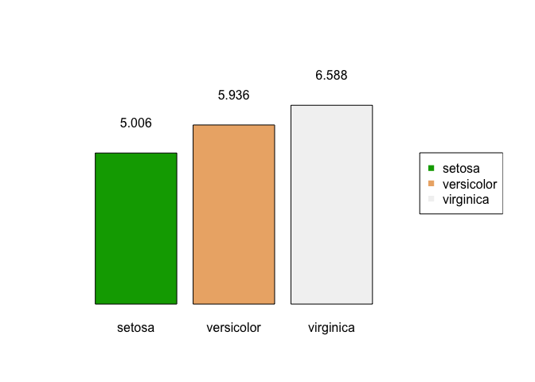

堆砌和分组的条形图：列联表的可视化
----------------------------------

``` r
l <- table( mtcars$cyl , mtcars$gear);l
```

    ##    
    ##      3  4  5
    ##   4  1  8  2
    ##   6  2  4  1
    ##   8 12  0  2

``` r
barplot( l, beside=T, main = "car tpyes: cyl and gear", 
         names.arg=c( "gear=3","gear=4","gear=5"), 
         legend=c("cyl=4", "cly=6", "cyl=8"))
```

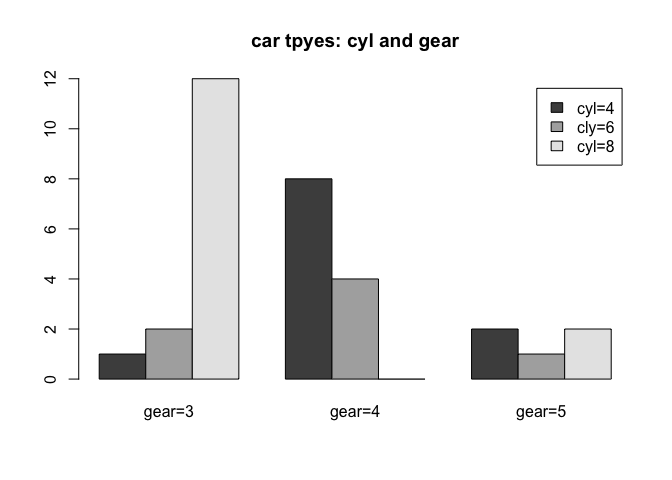

``` r
barplot( l, beside=F, main = "car tpyes: cyl and gear", 
         names.arg=c( "gear=3","gear=4","gear=5"), 
         legend=c("cyl=4", "cly=6", "cyl=8"))
```

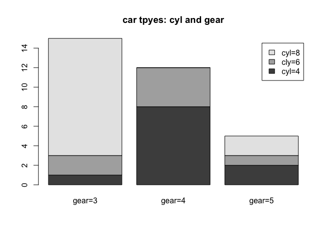

点图：单变量的分类展示，适合类别很多的情况
------------------------------------------

``` r
# Dotplot: Grouped Sorted and Colored
# Sort by mpg, group and color by cylinder 
x <- mtcars[order(mtcars$mpg),] # sort by mpg
x$cyl <- factor(x$cyl) # it must be a factor
x$color[x$cyl==4] <- "red"
x$color[x$cyl==6] <- "blue"
x$color[x$cyl==8] <- "darkgreen" 
dotchart( x$mpg, labels=row.names(x), cex=.7, groups= x$cyl,
         main="Gas Milage for Car Models\ngrouped by cylinder",
         xlab="Miles Per Gallon", gcolor="black", color=x$color)
```

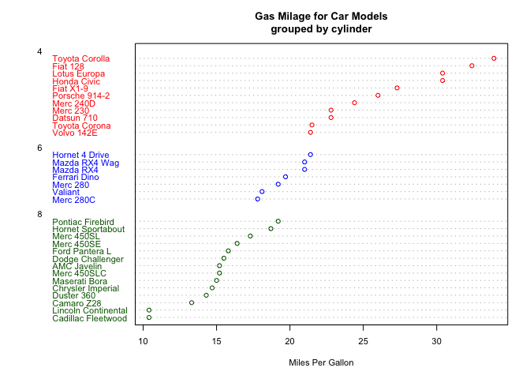

plot族
------

高水平（high-level）绘图函数
- 在图形设备上产生一个新的绘图区域，并生成一个新的图形 - 通过其参数可以设置坐标轴，标签，标题等等 低水平（low-level）绘图函数
- 在已存在的图形上加上更多的图形元素，是绘制图形的基础函数 - 如额外的点、线、多边形和标签 交互式绘图函数
- 允许交互式地用定点设备（如鼠标）在已经存在的图上添加/提取图形信息

### 简单散点图xy

``` r
# 简单漂亮的散点图：两个连续变量之间的关系

plot(cars$dist~cars$speed, # y~x
     main="Relationship between car distance & speed", #Plot Title
     xlab="Speed (miles per hour)", #X axis title
     ylab="Distance travelled (miles)", #Y axis title
     xlim=c(0,30), 
     yaxs="i", #Set y axis style as internal  
     col="red", #Set the colour of plotting symbol to red 
     pch=19) #Set the plotting symbol to filled dots
```

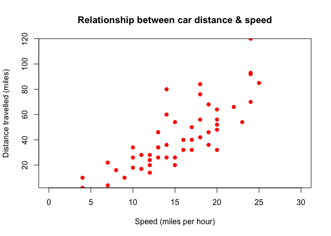

### 三维散点图(离散类别)

``` r
# 分类散点图

str(iris)
```

    ## 'data.frame':    150 obs. of  5 variables:
    ##  $ Sepal.Length: num  5.1 4.9 4.7 4.6 5 5.4 4.6 5 4.4 4.9 ...
    ##  $ Sepal.Width : num  3.5 3 3.2 3.1 3.6 3.9 3.4 3.4 2.9 3.1 ...
    ##  $ Petal.Length: num  1.4 1.4 1.3 1.5 1.4 1.7 1.4 1.5 1.4 1.5 ...
    ##  $ Petal.Width : num  0.2 0.2 0.2 0.2 0.2 0.4 0.3 0.2 0.2 0.1 ...
    ##  $ Species     : Factor w/ 3 levels "setosa","versicolor",..: 1 1 1 1 1 1 1 1 1 1 ...

``` r
idx = as.integer(iris[["Species"]]) # 先将鸢尾花的类型转化为整数1 、2 、3，便于使用向量
plot(iris[, 3:4],   # 数据长和宽
     pch = c(24, 21, 25)[idx],  # 注意这里integer的用法
     col = c("black","red", "blue")[idx], 
     panel.first = grid())
legend("topleft", 
       legend = levels(iris[["Species"]]), 
       col = c("black", "red", "blue"),
       pch = c(24, 21, 25), bty = "n")
```


``` r
## matplot 分类散点图，强化类别差异的表现
nam.var <- colnames(iris)[-5]
nam.spec <- as.character(iris[1+50*0:2, "Species"])
iris.S <- array(NA, dim = c(50,4,3),
                dimnames = list(NULL, nam.var, nam.spec))
for(i in 1:3) iris.S[,,i] <- data.matrix(iris[1:50+50*(i-1), -5])
matplot(iris.S[, "Petal.Length",], iris.S[, "Petal.Width",], pch = "SCV",
        col = rainbow(3, start = 0.8, end = 0.1),
        sub = paste(c("S", "C", "V"), dimnames(iris.S)[[3]],
                    sep = "=", collapse= ",  "),
        main = "Fisher's Iris Data")


## 二维变量体现类别差异的展现方式

library(car)
```

    ## Warning: package 'car' was built under R version 3.2.5

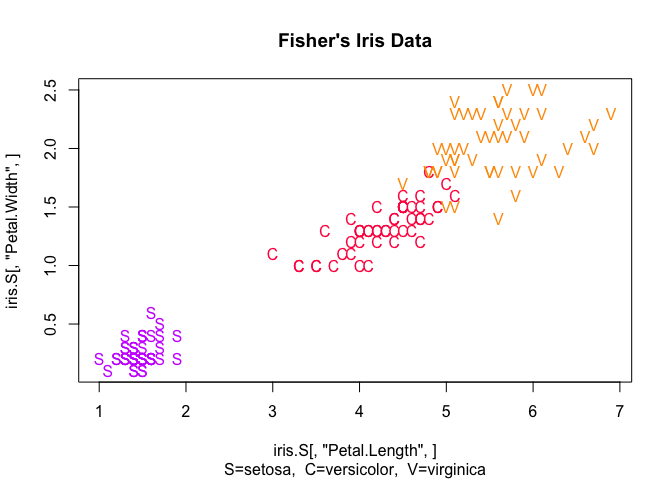

``` r
class = as.character( iris$Species)
scatterplot( Sepal.Length ~ Sepal.Width ,data = iris , 
             groups = class , 
            grid=TRUE,
            smoother=FALSE, reg.line=FALSE, ellipse=TRUE)
```

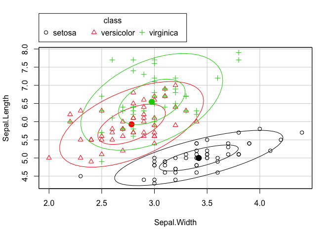

coplot
------

coplot()函数能够说明三向甚至四向关系
它特别于适合观察当给定其他预测变量时，反应变量如何根据一个预测变量变化。

``` r
coplot( mtcars$wt ~ mtcars$mpg | as.factor(mtcars$cyl) * as.factor(mtcars$vs), 
  main="", xlab="", ylab="", pch=19)
```

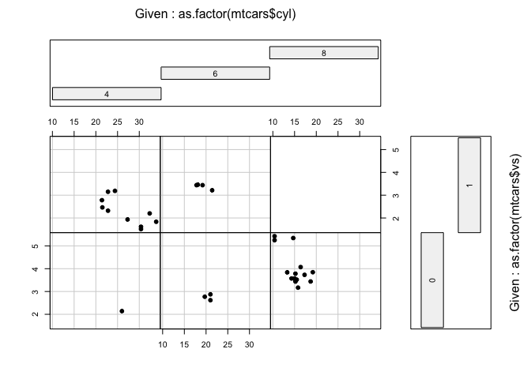

多变量的散点图矩阵
------------------

``` r
pairs( ~ Sepal.Length + Sepal.Width + Petal.Length +Petal.Width, data=iris)
plot(  ~ Sepal.Length + Sepal.Width + Petal.Length +Petal.Width, data=iris )
```

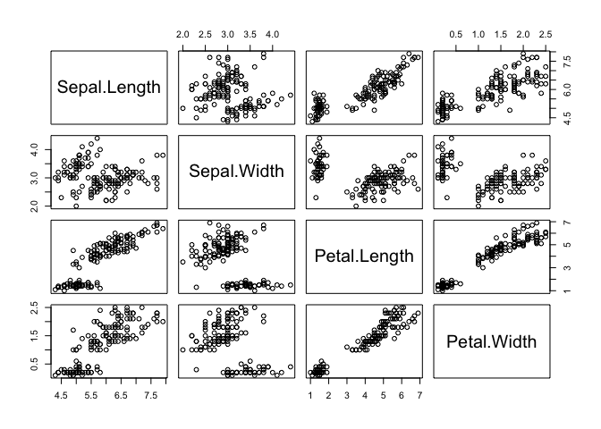

其他图形
========

用散点图表示时间序列数据
------------------------

``` r
data <- VADeaths
plot(data[,1] ,type="b" , lwd =2, xaxt="n" , ylim=c(0, 75) ,
     main ="Death Rates in Virginia (1940)", xlab="age", ylab="Death Rate"  )
axis( 1, at=1:nrow(data) ,labels = row.names(data) )
lines( data[,2], type="b" , lwd =2, col="red" )
lines( data[,3], type="b" , lwd =2, col="orange" )
lines( data[,4], type="b" , lwd =2, col="purple" )
legend( 4,30 , legend=colnames(data) , lty=1, lwd=2, pch=21, bty="n" ,
        col=c("black","red","orange","purple") , cex =0.8, inset=0.01)
grid()
```

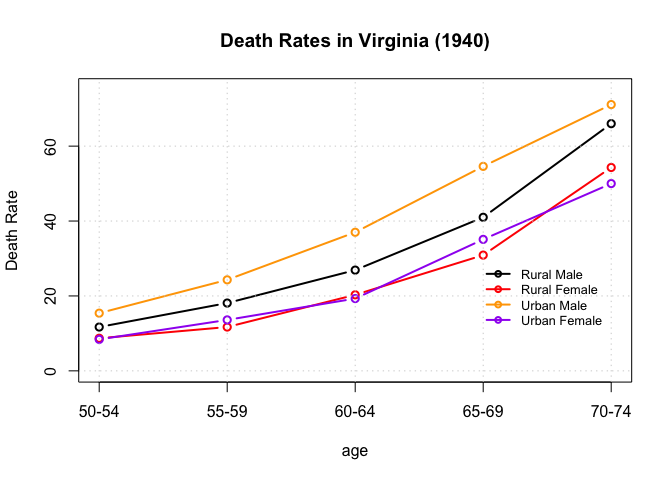

函数图
------

``` r
y1 <- function(x) {
  (2*x+sqrt(5-21*x^2))/5
}
y2 <- function(x) {
  (2*x-sqrt(5-21*x^2))/5
}

low <- -sqrt(5/21)
high <- sqrt(5/21)
curve(y1, low, high, ylim=c(low, high))
curve(y2, low, high, add=T)
```

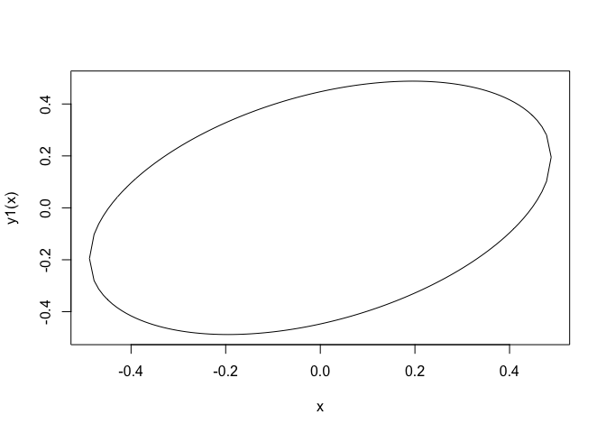

随机点的艺术作品
----------------

``` r
par(mar = c(0.2, 0.2, 0.2, 0.2), mfrow = c(2, 2))
for (n in c(63, 60, 76, 74)) {
  set.seed(711)
  plot.new()
  size = c(replicate(n, 1/rbeta(2, 1.5, 4)))
  center = t(replicate(n, runif(2)))
  center = center[rep(1:n, each = 2), ]
  color = apply( replicate(2 * n, sample(c(0:9,
    LETTERS[1:6]), 8, TRUE)), 2, function(x) sprintf("#%s", paste(x, collapse = "")))
  points(center, cex = size, pch = rep(20:21, n),  col = color)
  box()
}
```


多边形
------

用空plot搭建框架，line描结构，polygon填内容

``` r
col1 = "red";col2="blue";col3="green"
par( bg="grey25" ) #背景
plot( x=c(1), y=c(2.5), col="gray27", xlim=c(0,5), ylim=c(0,10),
      axes=F,ann=F,pch=20)#坐标
#画线
lines(c(1,1),c(2.5,8),col=col1,lwd=5);
lines(c(2,2),c(2.5,8),col=col1,lwd=5);
lines(c(2,2),c(0,2.5),col=col2,lwd=5);
lines(c(3,3),c(2,4.7),col=col2,lwd=5);
lines(c(3,3),c(4.7,6),col=col3,lwd=5);
lines(c(3,3),c(6,8),col=col1,lwd=5);
lines(c(4,4),c(1,3.5),col=col2,lwd=5);
lines(c(4,4),c(3.5,4.8),col=col3,lwd=5);
lines(c(4,4),c(4.8,6.2),col=col1,lwd=5);
lines(c(4,4),c(6.2,7.2),col=col2,lwd=5);
lines(c(4,4),c(7.2,8),col=col1,lwd=5);
#画矩阵
polygon(c(1,2,2,1),c(2.5,2.5,8,8),col=col1,border=col1,density=c(100));
polygon(c(2,3,3,2),c(6,6,8,8),col=col1,border=col1,density=c(100));
polygon(c(3,4,4,3),c(6,4.8,6.2,7.2),col=col1,border=col1,density=c(100));
polygon(c(3,4,4,3),c(7.2,7.2,8,8),col=col1,border=col1,density=c(100));
polygon(c(2,3,3,2),c(0,2,4.7,2.5),col=col1,border=col1,density=c(100));
polygon(c(3,4,4,3),c(2,1,3.5,4.7),col=col2,border=col2,density=c(100));
polygon(c(3,4,4,3),c(2,1,3.5,4.7),col=col2,border=col2,density=c(100));
polygon(c(3,4,4,3),c(4.7,3.5,4.8,6),col=col3,border=col3,density=c(100));
#文字
text(c(1:4),c(8.5),labels=c(paste("version",1:4,sep="")),col="white");
text( 0.5 ,c(1.0,0.5,0),labels=c("mary","suzanne","martin"),col=c(col1,col2,col3));
```

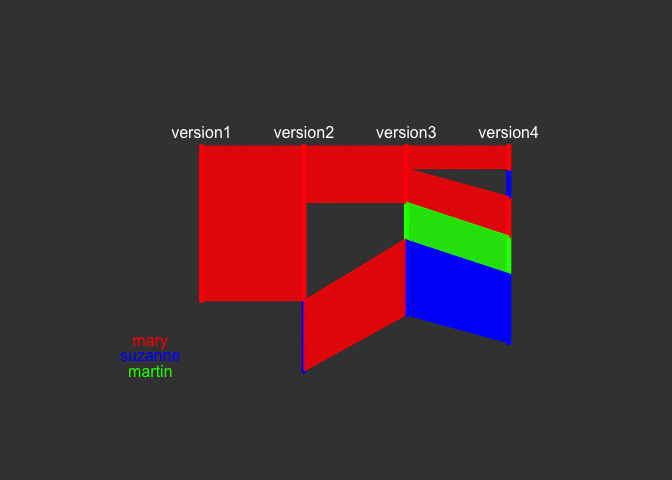

参数参考
========

玩全局参数
----------

线条形状定义

``` r
par("lty") 
```

    ## [1] "solid"

par( lty = "dashed") "blank", "solid", "dashed", "dotted", "dotdash", "longdash" or "twodash"

par( "bg") \# background color par(bg = "grey")

par("mar") par( mar = c( 1,1,1,1) )

par("mfrow") \# n plot in one canvas par(mfrow = c(1,2))

par( "oma") \# outer margine par( oma = c(0,0,2,0)) barplot( table(iris\[,5\]))

``` r
# a example of mult-plots
par( mfrow = c(1,2), oma = c(0,0,2,0)) # oma outer margine

with( airquality, {
  plot( Wind, Ozone, main = "Ozone and Wind")
  plot( Solar.R, Ozone, main = "Ozone and Solar Radiation")
  mtext( "Ozone and Weather in New York City", outer = TRUE)
})
```


``` r
dev.off()
```

    ## null device 
    ##           1

玩线条形状
----------

``` r
x <- c(1:5); y <- x # create some data 
par(pch=22, col="red") # plotting symbol and color 
par(mfrow=c(2,4)) # all plots on one page 
opts = c("p","l","o","b","c","s","S","h") 
for(i in 1:length(opts)){ 
  heading = paste("type=",opts[i]) 
  plot(x, y, type="n", main=heading) 
  lines(x, y, type=opts[i]) 
}
```

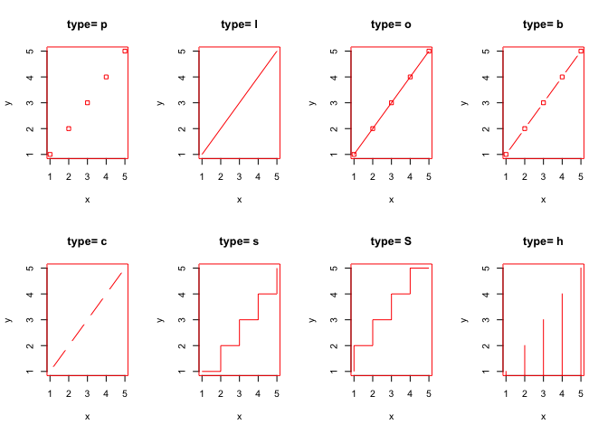

玩颜色
------

``` r
library( RColorBrewer)
display.brewer.all(n=10, exact.n=FALSE) # 调色板
```


``` r
col= brewer.pal( n  ,"Set1") # 引用颜色
```

    ## Warning in brewer.pal(n, "Set1"): n too large, allowed maximum for palette Set1 is 9
    ## Returning the palette you asked for with that many colors

玩坐标轴
--------

``` r
x <- c(1:10); y <- x; z <- 10/x
# 为一个坐标在右边创建额外页边空间 
par(mar=c(5, 4, 4, 8) + 0.1)
# 绘制 x 相对 y 
plot(x, y,type="b", pch=21, col="red", 
     yaxt="n", lty=3, xlab="", ylab="")
# 添加 x 相对 1/x 
lines(x, z, type="b", pch=22, col="blue", lty=2)
# 在左边画一条轴线 
axis(2, at=x,labels=x, col.axis="red", las=0)
# 用小字体标记在右边画一条轴线
axis(4, at=z,labels=round(z,digits=2),
     col.axis="blue", las=2, cex.axis=0.7, tck=-.01)
# 为右边轴线添加标题 
mtext("y=1/x", side=4, line=3, cex.lab=1,las=2, col="blue")
# 添加主标题，底和左轴标签 
title("An Example of Creative Axes", xlab="X values",
      ylab="Y=X")
```

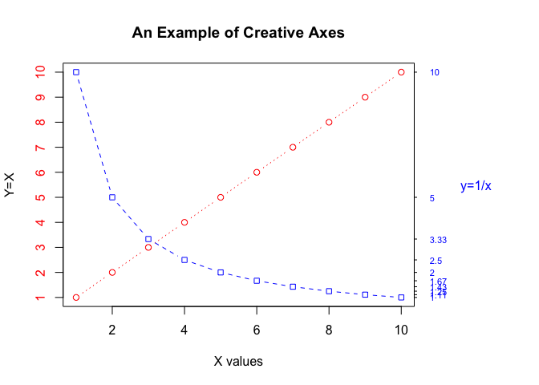

玩辅助线和图例
--------------

``` r
plot(1:10, type = "n", xlim = c(0, 20), ylim = c(0, 20)) # 不作图，只画出框架，且指定坐标轴范围
lines(1:10, abs(rnorm(10)))  # 10个正态随机数绝对值的波动线
# 不同的直线
abline(a = 0, b = 1, col = "gray")
abline(v = 2, lty = 2)
abline(h = 2, lty = 2)
#添加文本
text(8, 3, "abline(a = 0, b = 1)")
# 添加箭头
arrows(8, 3.5, 6, 5.7, angle = 40)
# 参数用了向量：不同灰度的线段
segments(rep(3, 4), 6:9, rep(5, 4), 6:9, col = gray(seq(0.2, 0.8, length = 4)))
text(4, 9.8, "segments")
```

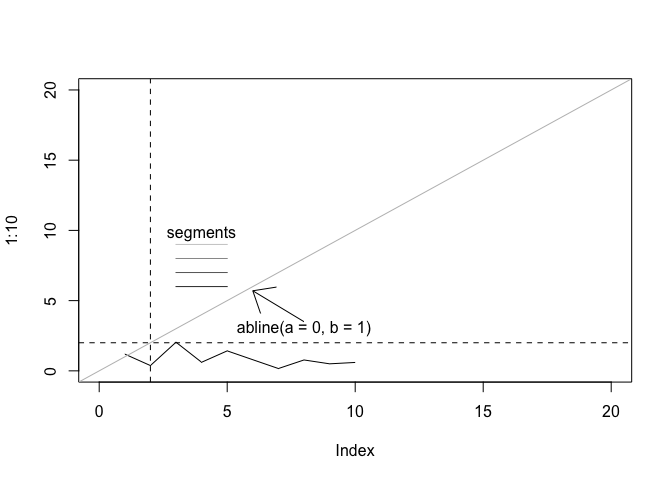

------------------------------------------------------------------------

文本和符号大小
--------------

cex - cex.axis 坐标轴刻度标记的缩放比例 - cex.lab 坐标轴标题的缩放比例 - cex.main 指定主标题的缩放比例 - cex.sub 子标题的缩放比例

点类型
------

pch 争取画一张各类型的点图出来

lty(Line TYpe) 参数值可以为整数或字符串：0=blank, 1=solid (default), 2=dashed, 3=dotted, 4=dotdash, 5=longdash, 6=twodash

lwd(Line WiDth) 设置线条的相对宽度，默认值为1

col 默认的绘图颜色 col.axis 坐标轴刻度标记的颜色 col.lab 坐标轴标题的颜色 col.main 主标题的颜色 col.sub 子标题的颜色 fg 设置前景色 bg 设置背景色

font 1=普通, 2=粗体, 3=斜体, 4=粗斜体, 5=符号字体 font.axis 坐标轴刻度标签的字体样式 font.lab 坐标轴标题的字体 font.main/font.sub 主标题/子标题的字体 family 字体族，标准值包含“serif”, “sans”, “mono”, “symbol”，其映射依赖于具体的设备，在Windows设置中，分别被映射为” TT Times New Roman”、” TT Arial”、” TT Courier New”、” TT Symbol”（TT=True Type）

低水平绘图函数：点、直线、线段、箭头、网格线

points 在当前绘图区增加点 lines 在当前绘图区增加连接线 abline(a,b) abline(h=y) abline(v=x) abline(lm:obj) 在当前绘图区增加一个斜率为b，截距为a的直线。 h=y可用于指定贯穿整个图的水平线高度的y-坐标。 v=x类似地用于指定垂直线的x-坐标。 lm:obj 可能是一个有长度为2的coefficients 分量(如模型拟合的结果)的列表。该分量中依次含有截距和斜率。 segments 绘制点对之间的线段 arrows 绘制点对之间的箭头 grid 在当前绘图区增加网格线

``` r
## 基本实现
plot(-4:4, -4:4, type = "p", col="blue")
## 绘制点、连接点
points(x=c(3,-2,-1,3,2), y=c(1,2,-2,2,3), col = "red")
lines(x=c(3,-2,-1,3,2), y=c(1,2,-2,2,3),col="black")
## 绘制直线
abline(h=0)
abline(v=0)
abline(a=1,b=1)
abline(lm(mtcars$mpg ~ mtcars$qsec),col="red")
## 绘制线段
segments(x0=2, y0=-4.5, x1=4, y1=-2, col="red", lty="dotted")
## 绘制箭头,并设置箭头的长度、角度、样式
arrows(x0=-4, y0=4, x1=-2, y1=0, length=0.15, angle=30, code=3)
##绘制网格线
grid(nx=3, ny=5, col = "lightgray", lty = "dotted")
```

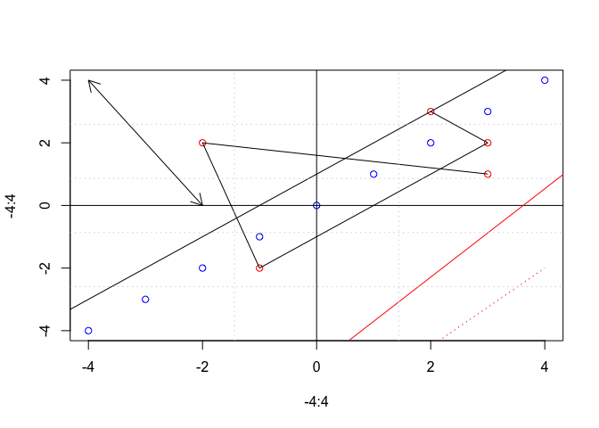

基本实现
--------

``` r
plot(-4:4, -4:4, type = "p", col="blue")
polygon( x=c(3,-2,-1,3,2), y=c(1,2,-2,2,3), col = "red") # 绘制多边形
rect( xleft=c(-4,0), ybottom=c(2,-4),  xright=c(-2,2), ytop=c(4,-2), 
      col = c("blue", "yellow")) # 绘制两个矩形，并填充颜色
```

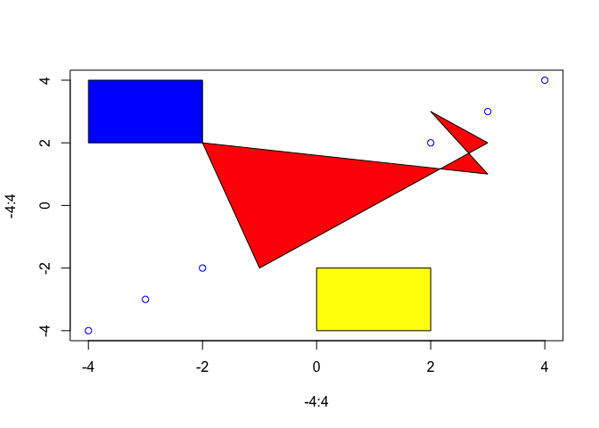
