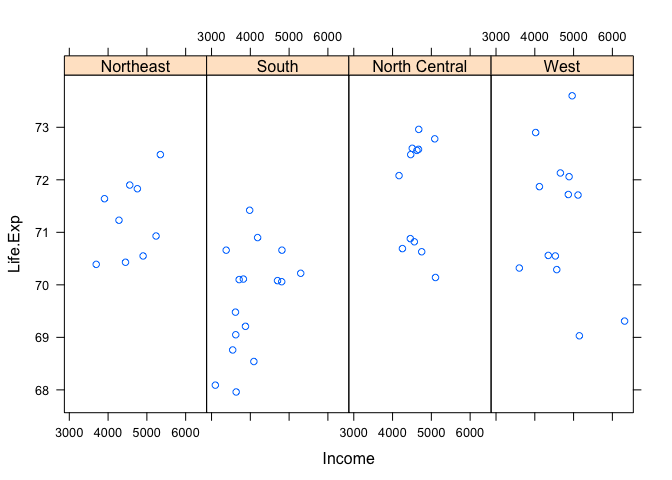
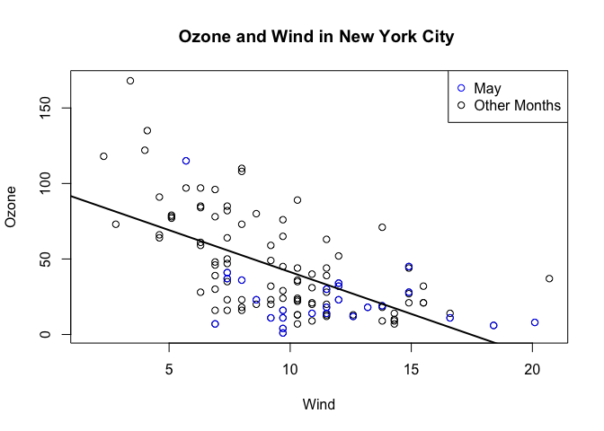
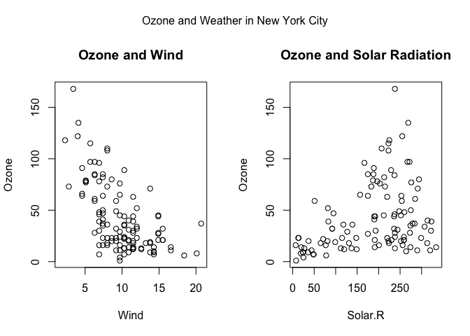

\[cousera???ݿ?ѧ\]Exploratory Data Analysis
================
Dingchong
Friday, March 20, 2015

WEEK 1
------

### 1.Introduction

### 2.principles of analytic graphics

Principle 1: show comparisons

-   Always ask "compared to what? "
-   Related things

Principle 2: show causality, mechanism, explanation, systemiatic structure

-   what is your causal framework for thinking about a question?

Principle 3: show multivariate data

-   more than 2 variables
-   ???Σ??㡢?ߡ????Σ?,??ͼ

Principle 4: Integration of evidence

-   Completely integrate words, numbers, images, diagrams...

Principle 5: Describe with appropriate labels, scales, sources, etc

### 3.Exploratory Graphs

boxplot histogram scatterplot

### 4.Plotting Systems in R

3 core systems

1 the base plotting system

pros: start with blank canvas and build up from there start with plot function( or similar) use annotation functions to add/modify( text, lines, points, axis )

cons: can't go back once plot has started( ie. to adjust margins); need to plan first difficult to 'translate' to others once a new plot has been created( no graphical language) plot is just a series of R commands

``` r
library(datasets)
data(cars)
with( cars, plot(speed, dist))
```


2 the lattice system

pros: single function call(xplot, bwplot) most useful for conditiong types of plots: looking at how y changes with x across levels of z automatically setting margins and spacing good for many many plots on screen

cons: cannot add to the plot once it is created

``` r
library( lattice)
```

    ## Warning: package 'lattice' was built under R version 3.2.5

``` r
state = data.frame( state.x77, region = state.region)
xyplot( Life.Exp ~ Income | region , data = state , layout = c(4,1))
```



3 ggplot2 system

pros: automatically deals with spacings, text... easy to use than lattice default is useful

``` r
library(ggplot2)
```

    ## Warning: package 'ggplot2' was built under R version 3.2.5

``` r
data(mpg)
qplot( displ, hwy, data =mpg)
```


4 base plotting system

package: 1.graphics: plot, hist, boxplot... 2.grDevices: X11, PDF, PNG, PostScript...

do you need to dynamically resize the plot?

par()

oma : outer margin size ( default is 0 for all sides )

``` r
par("lty")
```

    ## [1] "solid"

``` r
par("bg")
```

    ## [1] "white"

``` r
par("mar")
```

    ## [1] 5.1 4.1 4.1 2.1

``` r
par("mfrow")
```

    ## [1] 1 1

base ploting functions

plot lines points text title mtext: margin text aixs

``` r
library(datasets)
with( airquality , plot( Wind, Ozone))
title( main = "Ozone and Wind in New York City ") 

# add points
with( subset(airquality , Month ==5), points( Wind, Ozone, col = "blue")) 
legend( "topright", pch =1, col = c("blue", "black"), 
        legend = c("May", "Other Months"))

model = lm(Ozone ~ Wind, airquality )
abline( model, lwd = 2)
```



multiple base plots

``` r
par( mfrow = c(1,2), oma = c(0,0,2,0)) # oma outer margine

with( airquality, {
  plot( Wind, Ozone, main = "Ozone and Wind")
  plot( Solar.R, Ozone, main = "Ozone and Solar Radiation")
  mtext( "Ozone and Weather in New York City", outer = TRUE)
})
```



### 5.Graphics Devices in R
