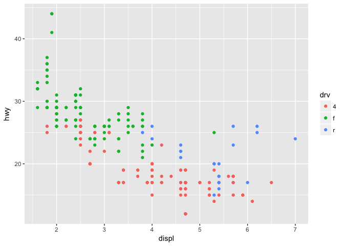

exploratory data analysis 2
================
Dingchong
Tuesday, March 17, 2015

WEEK 2 Lattice and ggplot2
--------------------------

### 1.Latice Plotting System

xyplot: scatterplots, y~ x with condition argument

``` r
library(lattice, datasets)
```

    ## Warning: package 'lattice' was built under R version 3.2.5

``` r
ariquality = transform( airquality , Month = factor(Month))
xyplot( Ozone ~ Wind | Month, data = ariquality, layout = c(5,1))
```


``` r
# panel functions
```

bwplot: box-and-whiskers plots( "boxlots") historgram stripplot : like boxplot but with actual points dotplot : plot dots on 'violin strings' splom : scatterplot matrix: like pairs in base plotting system levelplot, contourplot : "image" data

### 2.ggplot2

basice: qplot()

``` r
library(ggplot2)
```

    ## Warning: package 'ggplot2' was built under R version 3.2.5

``` r
str(mpg)
```

    ## Classes 'tbl_df', 'tbl' and 'data.frame':    234 obs. of  11 variables:
    ##  $ manufacturer: chr  "audi" "audi" "audi" "audi" ...
    ##  $ model       : chr  "a4" "a4" "a4" "a4" ...
    ##  $ displ       : num  1.8 1.8 2 2 2.8 2.8 3.1 1.8 1.8 2 ...
    ##  $ year        : int  1999 1999 2008 2008 1999 1999 2008 1999 1999 2008 ...
    ##  $ cyl         : int  4 4 4 4 6 6 6 4 4 4 ...
    ##  $ trans       : chr  "auto(l5)" "manual(m5)" "manual(m6)" "auto(av)" ...
    ##  $ drv         : chr  "f" "f" "f" "f" ...
    ##  $ cty         : int  18 21 20 21 16 18 18 18 16 20 ...
    ##  $ hwy         : int  29 29 31 30 26 26 27 26 25 28 ...
    ##  $ fl          : chr  "p" "p" "p" "p" ...
    ##  $ class       : chr  "compact" "compact" "compact" "compact" ...

``` r
# 2 vaiable : scatter
qplot( displ, hwy, data = mpg, color = drv )
```



``` r
qplot( displ, hwy, data = mpg, geom = c("point", "smooth"))
```

    ## `geom_smooth()` using method = 'loess'


``` r
qplot( displ, hwy, data = mpg, geom = c("point", "smooth"), method = "lm")
```

    ## Warning: Ignoring unknown parameters: method


``` r
# 1 variable : bar
qplot( hwy, data = mpg, fill = drv )
```

    ## `stat_bin()` using `bins = 30`. Pick better value with `binwidth`.


``` r
qplot( log(hwy) , data = mpg, fill = drv )
```

    ## `stat_bin()` using `bins = 30`. Pick better value with `binwidth`.


``` r
qplot( log(hwy) , data = mpg, fill = drv, geom = "density" )
```


``` r
qplot( log(hwy) , data = mpg, color = drv, geom = "density" )
```


``` r
# subsets, with facets
qplot( displ, hwy, data = mpg, facets = .~drv )
```


``` r
qplot( hwy, data = mpg, facets = .~drv, binwidth =2  ) 
```


``` r
qplot( hwy, data = mpg, facets = drv~. , binwidth =2  )
```


basic components of a ggplot2

A data frame aesthetic mappings : how data are mapped to color, size geoms : geometric objects like points, lines, shapes. facets: for conditional plots stats : statistical transformations like binning, quantiles, smoothing. scales : what scale an aesthetic map uses ( example : male = red, female = blue ) coordinate system

A notes about axis limits

``` r
testdat = data.frame( x=1:100, y = rnorm(100))
testdat[50,2] = 100 ## outlier
plot( testdat$x, testdat$y, type ="l", ylim = c(-3,3))
```


``` r
g = ggplot( testdat, aes(x =x, y=y))
g + geom_line()
```


``` r
# outlier missing
g = ggplot( testdat, aes(x =x, y=y))
g + geom_line() + ylim( -3, 3)
```


``` r
# outlier included
g = ggplot( testdat, aes(x =x, y=y))
g + geom_line() + coord_cartesian( ylim = c(-3,3))
```


a full story

``` r
str(mpg)
```

    ## Classes 'tbl_df', 'tbl' and 'data.frame':    234 obs. of  11 variables:
    ##  $ manufacturer: chr  "audi" "audi" "audi" "audi" ...
    ##  $ model       : chr  "a4" "a4" "a4" "a4" ...
    ##  $ displ       : num  1.8 1.8 2 2 2.8 2.8 3.1 1.8 1.8 2 ...
    ##  $ year        : int  1999 1999 2008 2008 1999 1999 2008 1999 1999 2008 ...
    ##  $ cyl         : int  4 4 4 4 6 6 6 4 4 4 ...
    ##  $ trans       : chr  "auto(l5)" "manual(m5)" "manual(m6)" "auto(av)" ...
    ##  $ drv         : chr  "f" "f" "f" "f" ...
    ##  $ cty         : int  18 21 20 21 16 18 18 18 16 20 ...
    ##  $ hwy         : int  29 29 31 30 26 26 27 26 25 28 ...
    ##  $ fl          : chr  "p" "p" "p" "p" ...
    ##  $ class       : chr  "compact" "compact" "compact" "compact" ...

``` r
g = ggplot( mpg, aes(x =displ, y= hwy)) 
g + geom_point( alpha = 1/3 )  + # add points
  facet_wrap( drv ~ cyl) + # factors in different color
  geom_smooth( method ="lm", col = "steelblue ") + # smoother
  theme_bw( base_family = "", base_size = 20 ) + # size, character
  labs( x = expression( "log" )) + 
  labs( y = "Nocturnal Symptons") + 
  labs( title = "MAACS Cohort" )
```


