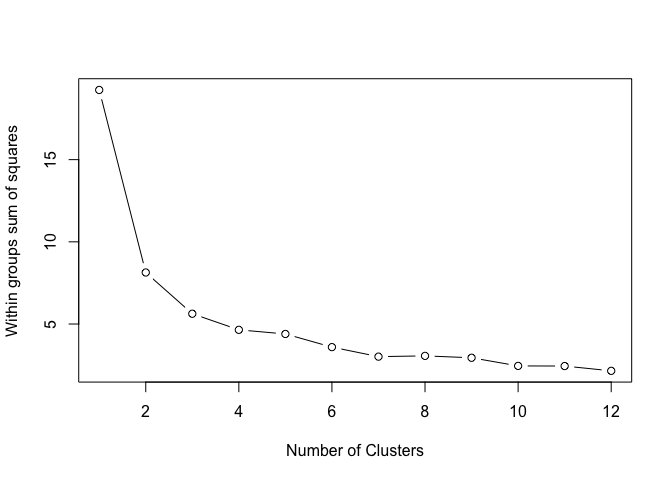
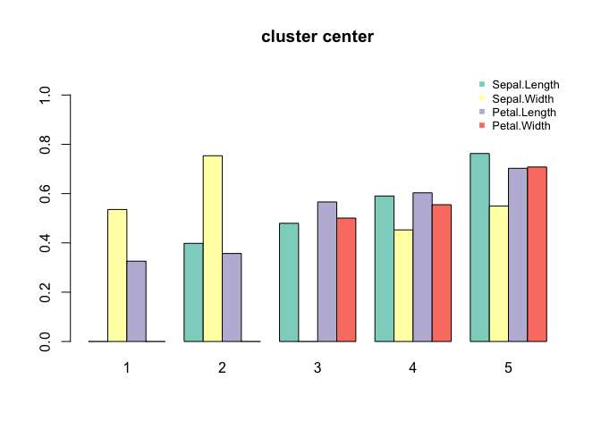
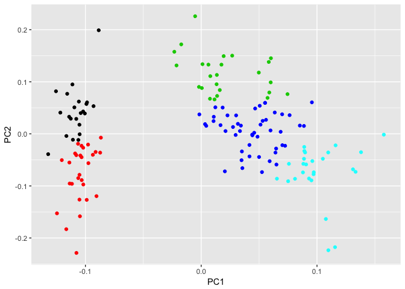

R Markdown
----------

kmeans functioin
================

    min.max.norm <- function(x){ (x-min(x))/(max(x)-min(x))}

read data and raw summary
=========================

    data1 <- iris[ ,-5 ]
    summary(data1)

    ##   Sepal.Length    Sepal.Width     Petal.Length    Petal.Width   
    ##  Min.   :4.300   Min.   :2.000   Min.   :1.000   Min.   :0.100  
    ##  1st Qu.:5.100   1st Qu.:2.800   1st Qu.:1.600   1st Qu.:0.300  
    ##  Median :5.800   Median :3.000   Median :4.350   Median :1.300  
    ##  Mean   :5.843   Mean   :3.057   Mean   :3.758   Mean   :1.199  
    ##  3rd Qu.:6.400   3rd Qu.:3.300   3rd Qu.:5.100   3rd Qu.:1.800  
    ##  Max.   :7.900   Max.   :4.400   Max.   :6.900   Max.   :2.500

data fitness
============

### 常用变量处理：缺失值不全、汇总、剔除

resultdata\[is.na(resultdata) \] &lt;- 0
resultdata$heavyachor&lt;-rowSums(resultdata\[,c("flyscreentimes","seatptimes")\])

### 按列剔除

outnames=c("qq","X","impressiontimes","votetimes")
resultdata&lt;-resultdata\[,colnames(resultdata)%in%outnames\]
resultdata&lt;-resultdata\[,-which(names(resultdataCha)%in%outnames)\]

### 按行剔除

resultdataCha&lt;-resultdata\[-which(resultdata$qq %in%
c(2797467472,3072755924)),\]

\#\#\# scale
------------

    # soc$talktime <- log(data2$talktimes)

    cludata <- sapply( data1, function(x) min.max.norm( jtrans(x)$transformed ) )

轮廓系数，确定K
===============

    wss <- (nrow(cludata)-1)*sum(apply(cludata,2,var))
    k <- 2:12
    for (i in k) wss[i] <- sum(kmeans(cludata, centers=i)$withinss)
    plot(1:12, wss, type="b",
         xlab="Number of Clusters", ylab="Within groups sum of squares")

固定聚心聚类
============

    k = 5
    set.seed(777)
    clu <- kmeans( cludata ,k)
    # reorder cluster centers 
    ccenter <- clu$centers
    ccenter <- ccenter[order(ccenter[,1]),]
    clu <- kmeans( cludata , ccenter)

结果展示
========

### 聚类结果展示-较少变量的情况

    sum(clu$size)

    ## [1] 150

    clu$size

    ## [1] 22 28 25 49 26

    round( clu$centers,2)

    ##   Sepal.Length Sepal.Width Petal.Length Petal.Width
    ## 1         0.23        0.54         0.33        0.21
    ## 2         0.40        0.75         0.36        0.26
    ## 3         0.48        0.23         0.57        0.50
    ## 4         0.59        0.45         0.60        0.56
    ## 5         0.76        0.55         0.70        0.71

    aggregate( x=data1,by=list(clu$cluster), function(x) c( mean=mean(x), sd = sd(x)))

    ##   Group.1 Sepal.Length.mean Sepal.Length.sd Sepal.Width.mean
    ## 1       1         4.7045455       0.2126416        3.1227273
    ## 2       2         5.2428571       0.2410295        3.6678571
    ## 3       3         5.6320000       0.4413238        2.4560000
    ## 4       4         6.1816327       0.3945849        2.9326531
    ## 5       5         7.0192308       0.4980114        3.1576923
    ##   Sepal.Width.sd Petal.Length.mean Petal.Length.sd Petal.Width.mean
    ## 1      0.2524769         1.4136364       0.1909761       0.20000000
    ## 2      0.2749459         1.5000000       0.1515354       0.28214286
    ## 3      0.1850225         4.1360000       0.6264184       1.28000000
    ## 4      0.1760537         4.7693878       0.4709052       1.61020408
    ## 5      0.2844969         5.9038462       0.4812324       2.18076923
    ##   Petal.Width.sd
    ## 1     0.05345225
    ## 2     0.12187903
    ## 3     0.28284271
    ## 4     0.28375818
    ## 5     0.22981598

    barplot( ifelse( t(clu$centers)-0.3 >0, t(clu$centers), 0) ,
             main ='cluster center',
             beside = T, col= brewer.pal( ncol(cludata)  ,"Set3"),  
             names.arg = rownames( clu$centers ) , ylim=c( 0 ,1.1) )
    legend( legend= colnames( clu$centers)  ,  horiz = F, cex = 0.8, bty = "n",
            "topright", pch=15, col=brewer.pal( ncol(cludata) ,"Set3") ) 

    ifelse( clu$centers > 0.1,  round(clu$centers,2), 0) 

    ##   Sepal.Length Sepal.Width Petal.Length Petal.Width
    ## 1         0.23        0.54         0.33        0.21
    ## 2         0.40        0.75         0.36        0.26
    ## 3         0.48        0.23         0.57        0.50
    ## 4         0.59        0.45         0.60        0.56
    ## 5         0.76        0.55         0.70        0.71

### Biplot & Scatterplot Matrix

    clu.pca <- prcomp( data1,
                     center = TRUE,
                     scale. = TRUE) 

    summary(clu.pca)

    ## Importance of components%s:
    ##                           PC1    PC2     PC3     PC4
    ## Standard deviation     1.7084 0.9560 0.38309 0.14393
    ## Proportion of Variance 0.7296 0.2285 0.03669 0.00518
    ## Cumulative Proportion  0.7296 0.9581 0.99482 1.00000

    autoplot(clu.pca, colour = clu$cluster)

    ## Warning in if (value %in% columns) {: 条件的长度大于一，因此只能用其第一元
    ## 素

    # https://stackoverflow.com/questions/42913023/warning-message-from-ggfortifyggbiplot

### 聚类结果-变量较多的情况

计算不同聚类结果的数量和占比
============================

centerPer&lt;-sapply(ccenter\[,-1\],PercentCacu)

返回每个元素，在每个列中的位置
==============================

centerRank &lt;- data.frame(ccenter\[,c("clusterid")\]) for(i in
1:(ncol(ccenter)-1)) { centertemp&lt;-as.data.frame(rank(ccenter\[,i\]))

colnames(centertemp)&lt;-names(ccenter\[i\])

centerRank&lt;-cbind(centerRank,centertemp) }

ref
===

### johnson转换

\[方法标准\] <http://www.jmp.com/support/help/K-Means_Clustering.shtml>
\[公式\]
<https://support.minitab.com/en-us/minitab/18/help-and-how-to/quality-and-process-improvement/quality-tools/how-to/johnson-transformation/methods-and-formulas/methods-and-formulas/>
\[转换效果和实现\]
<https://rexplorations.wordpress.com/2015/11/03/johnson-transformation-for-non-normal-data/>
