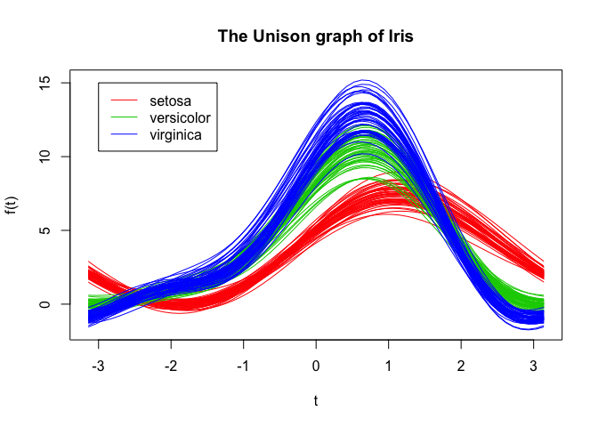
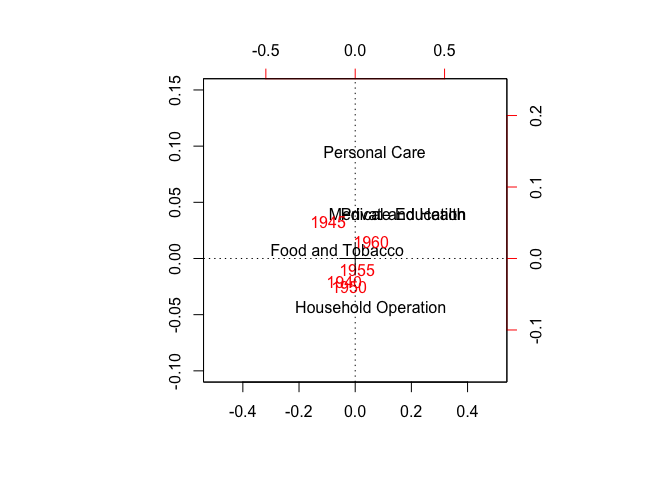
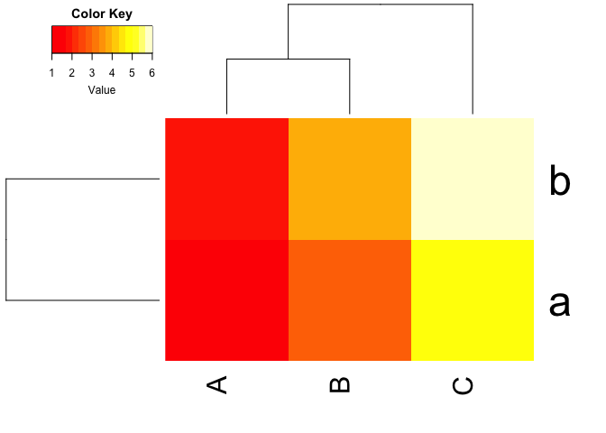
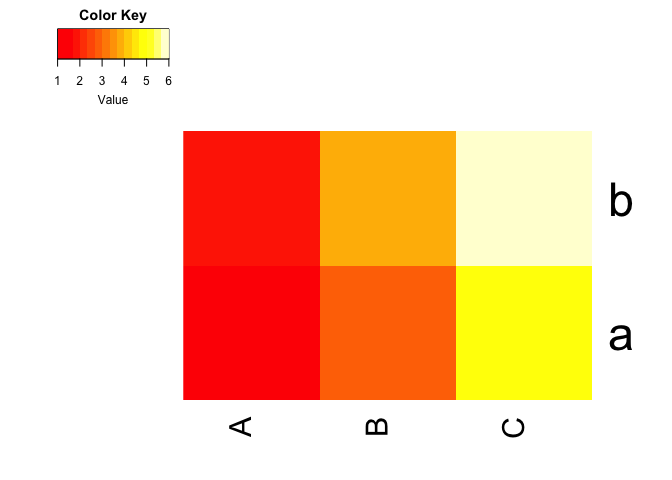
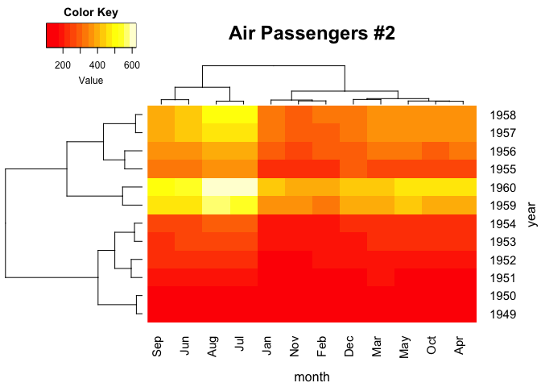
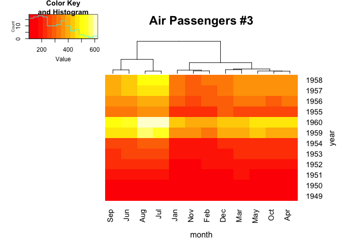
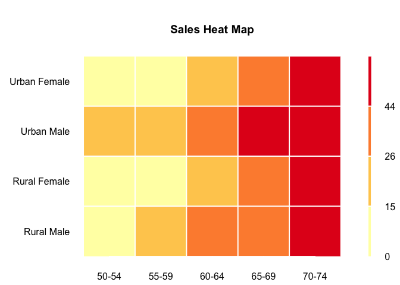
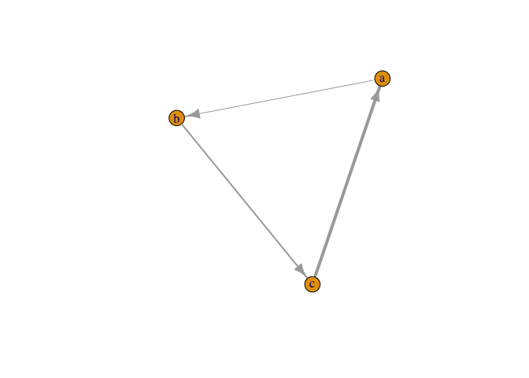
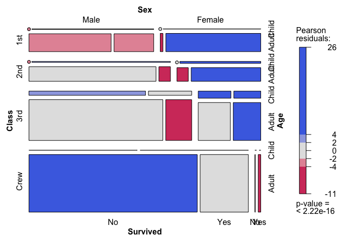
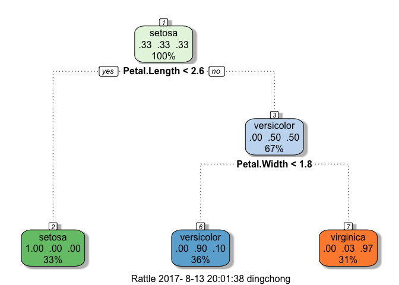

advanced plot
================
Dingchong
Friday, September 26, 2014

Purpose: elegant and powerful data exploration Data Used: iris, VADeaths Packages Used: MASS,RColorBrewer...

数据降维
========

调和曲线图
----------

调和曲线图的思想和傅立叶变换十分相似，是根据三角变换方法将 p 维空间的点映射到二维平面上的曲线上。

``` r
x = as.matrix(iris[1:4])
t = seq(-pi, pi, pi/30)
m = nrow(x)
n = ncol(x)
f = matrix(0, m, length(t))
for (i in 1:m) {
    f[i, ] = x[i, 1]/sqrt(2)
    for (j in 2:n) {
        if (j%%2 == 0)
            f[i, ] = f[i, ] + x[i, j] * sin(j/2 * t)
        else f[i, ] = f[i, ] + x[i, j] * cos(j%/%2 * t)
    }
}
plot(c(-pi, pi), c(min(f), max(f)), type = "n", main = "The Unison graph of Iris",
    xlab = "t", ylab = "f(t)")
for (i in 1:m) lines(t, f[i, ], col = c("red", "green3",
    "blue")[unclass(iris$Species[i])])
legend(x = -3, y = 15, c("setosa", "versicolor", "virginica"),
    lty = 1, col = c("red", "green3", "blue"))
```



对应分析：两个或多个变量之间的对应关系
--------------------------------------

``` r
library(MASS)
head(USPersonalExpenditure )
```

    ##                       1940   1945  1950 1955  1960
    ## Food and Tobacco    22.200 44.500 59.60 73.2 86.80
    ## Household Operation 10.500 15.500 29.00 36.5 46.20
    ## Medical and Health   3.530  5.760  9.71 14.0 21.10
    ## Personal Care        1.040  1.980  2.45  3.4  5.40
    ## Private Education    0.341  0.974  1.80  2.6  3.64

``` r
cal<-corresp(USPersonalExpenditure,nf=2) ;
```

    ## Warning in corresp.matrix(USPersonalExpenditure, nf = 2): negative or non-
    ## integer entries in table

``` r
biplot(cal,expand=1.5, xlim=c(-0.5 , 0.5), ylim=c(-0.1 , 0.15))
abline(v=0,h=0,lty=3) 
```



体现数据的相关性
================

热力图，用于展现相同数值在两个维度上的水平/相关系数
---------------------------------------------------

``` r
### loading packages
library(gplots)
```

    ## Warning: package 'gplots' was built under R version 3.2.4

    ## 
    ## Attaching package: 'gplots'

    ## The following object is masked from 'package:stats':
    ## 
    ##     lowess

``` r
library(lattice)
```

    ## Warning: package 'lattice' was built under R version 3.2.5

``` r
# 简单例子
a = matrix(1:6, nrow =2 )
a
```

    ##      [,1] [,2] [,3]
    ## [1,]    1    3    5
    ## [2,]    2    4    6

``` r
dimnames(a) =list( letters[1:2], LETTERS[1:3] )
a
```

    ##   A B C
    ## a 1 3 5
    ## b 2 4 6

``` r
heatmap.2(a, trace = 'none', density.info = "none")
```



``` r
heatmap.2(a, trace = 'none',  dendrogram = "none" , density.info = "none" )
```



``` r
### 复杂例子
data(AirPassengers)
### converting data
rowcolNames <- list(as.character(1949:1960), month.abb)
rowcolNames
```

    ## [[1]]
    ##  [1] "1949" "1950" "1951" "1952" "1953" "1954" "1955" "1956" "1957" "1958"
    ## [11] "1959" "1960"
    ## 
    ## [[2]]
    ##  [1] "Jan" "Feb" "Mar" "Apr" "May" "Jun" "Jul" "Aug" "Sep" "Oct" "Nov"
    ## [12] "Dec"

``` r
air_data <- matrix(AirPassengers,
                   ncol = 12,
                   byrow = TRUE,
                   dimnames = rowcolNames)
air_data
```

    ##      Jan Feb Mar Apr May Jun Jul Aug Sep Oct Nov Dec
    ## 1949 112 118 132 129 121 135 148 148 136 119 104 118
    ## 1950 115 126 141 135 125 149 170 170 158 133 114 140
    ## 1951 145 150 178 163 172 178 199 199 184 162 146 166
    ## 1952 171 180 193 181 183 218 230 242 209 191 172 194
    ## 1953 196 196 236 235 229 243 264 272 237 211 180 201
    ## 1954 204 188 235 227 234 264 302 293 259 229 203 229
    ## 1955 242 233 267 269 270 315 364 347 312 274 237 278
    ## 1956 284 277 317 313 318 374 413 405 355 306 271 306
    ## 1957 315 301 356 348 355 422 465 467 404 347 305 336
    ## 1958 340 318 362 348 363 435 491 505 404 359 310 337
    ## 1959 360 342 406 396 420 472 548 559 463 407 362 405
    ## 1960 417 391 419 461 472 535 622 606 508 461 390 432

``` r
### drawing heat maps

# 2) Air Passengers #2
heatmap.2(air_data,
          trace = "none",
          density.info = "none",
          xlab = "month",
          ylab = "year",
          main = "Air Passengers #2")
```



``` r
# 3) Air Passengers #3
heatmap.2(air_data,
          trace = "none",
          xlab = "month",
          ylab = "year",
          main = "Air Passengers #3",
          density.info = "histogram",
          dendrogram = "column",
          keysize = 1.8)
```



``` r
library(RColorBrewer)
data <- VADeaths
pal=brewer.pal(4,"YlOrRd")
breaks<-c(0, 15, 26, 44, 72)
layout(matrix(data=c(1,2),  nrow=1, ncol=2), widths=c(8,1),
       heights=c(1,1))  ## 画一个空白的图形画板，按照参数把图形区域分隔好
# 看layout的分割可以这样：
# xx <- layout(matrix(data=c(1,2),  nrow=1, ncol=2), widths=c(8,1), heights=c(1,1)) ; layout.show(xx)
par(mar = c(2,6,4,1 ), oma=c(0.1, 0.1 ,0.1 , 0.1), mex = 1.2 ) #Set margins for the heatmap
image(x=1:nrow(data),
      y=1:ncol(data),
      z=data,axes=FALSE,
      xlab="Month",   ylab="", main="Sales Heat Map" ,
      col=pal[1:(length(breaks)-1)],
      breaks=breaks ) # breaks 颜色块对应的数值（数值分组），要比颜色数量多1个
axis(1, col="white",las=1 , at=1:nrow(data), labels=rownames(data)  )
axis(2, col="white",las=1 , at=1:ncol(data), labels=colnames(data)  )
abline(h=c(1:ncol(data))+0.5, v=c(1:nrow(data))+0.5,  col="white",lwd=2,xpd=FALSE)
# 画标尺
breaks2 <- breaks[-length(breaks)]  # breaks 少一个
par(mar = c(2,1,4,2))
image(x = 1, y= 0:length(breaks2),
      z=t(matrix(breaks2))*1.001,
      col=pal[1:length(breaks)-1],
      axes=FALSE,breaks=breaks,
      xlab="", ylab="",xaxt="n")
axis(4,at=0:(length(breaks2)-1), labels=breaks2, col="white", las=1)
abline(h=c(1:length(breaks2)),col="white",lwd=2, xpd=F )
```



``` r
dev.off()
```

    ## null device 
    ##           1

网络图，基于社交关系的数据使这类图越来越火了
--------------------------------------------

``` r
require(igraph)
```

    ## Loading required package: igraph

    ## 
    ## Attaching package: 'igraph'

    ## The following objects are masked from 'package:stats':
    ## 
    ##     decompose, spectrum

    ## The following object is masked from 'package:base':
    ## 
    ##     union

``` r
d = data.frame(p1     = c('a', 'b', 'c'),
               p2     = c('b', 'c', 'a'),
               weight = c(1, 2, 4))
g = graph.data.frame(d, directed = TRUE)
plot(g, edge.width = E(g)$weight)
```



一个更生动的例子<http://cos.name/2012/03/how-to-vote/>

系统聚类：样本之间的关系疏密――基于空间距离
------------------------------------------

``` r
dist <-dist(scale(iris[,c(1:4)]))
hc <- hclust(dist, "ward")
```

    ## The "ward" method has been renamed to "ward.D"; note new "ward.D2"

``` r
plclust(hc,hang=-1 ,  labels=iris[,5]  )
```

    ## Warning: 'plclust' is deprecated.
    ## Use 'plot' instead.
    ## See help("Deprecated")

``` r
re<-rect.hclust(hc,k=4,border="red")
```


列联表数据的内部联系：马赛克图
------------------------------

r in action 上的例子

``` r
library(vcd)
```

    ## Warning: package 'vcd' was built under R version 3.2.5

    ## Loading required package: grid

``` r
ftable(Titanic)
```

    ##                    Survived  No Yes
    ## Class Sex    Age                   
    ## 1st   Male   Child            0   5
    ##              Adult          118  57
    ##       Female Child            0   1
    ##              Adult            4 140
    ## 2nd   Male   Child            0  11
    ##              Adult          154  14
    ##       Female Child            0  13
    ##              Adult           13  80
    ## 3rd   Male   Child           35  13
    ##              Adult          387  75
    ##       Female Child           17  14
    ##              Adult           89  76
    ## Crew  Male   Child            0   0
    ##              Adult          670 192
    ##       Female Child            0   0
    ##              Adult            3  20

``` r
mosaic( Titanic, shade = T, legend = T )
```



信息：

-   头等舱到船员的存活率差异巨大
-   大部分孩子都在三等舱中
-   头等舱女性存活率最高
-   go on and on ...

模型相关
========

决策树
------

``` r
library(caret)
```

    ## Warning: package 'caret' was built under R version 3.2.5

    ## Loading required package: ggplot2

    ## Warning: package 'ggplot2' was built under R version 3.2.5

``` r
inTrain <- createDataPartition( y = iris$Species, p=0.75, list=F)
training <- iris[inTrain, ]
testing <- iris[-inTrain, ]
modFit <- train( Species ~ . , method="rpart", data= training)
```

    ## Loading required package: rpart

``` r
# print( modFit$finalModel)
library(rattle);library(rpart.plot)
```

    ## Warning: Failed to load RGtk2 dynamic library, attempting to install it.

    ## Please install GTK+ from http://r.research.att.com/libs/GTK_2.24.17-X11.pkg

    ## If the package still does not load, please ensure that GTK+ is installed and that it is on your PATH environment variable

    ## IN ANY CASE, RESTART R BEFORE TRYING TO LOAD THE PACKAGE AGAIN

    ## Rattle: A free graphical interface for data mining with R.
    ## XXXX 4.1.0 Copyright (c) 2006-2015 Togaware Pty Ltd.
    ## 键入'rattle()'去轻摇、晃动、翻滚你的数据。

    ## Warning: package 'rpart.plot' was built under R version 3.2.5

``` r
fancyRpartPlot( modFit$finalModel)
```


