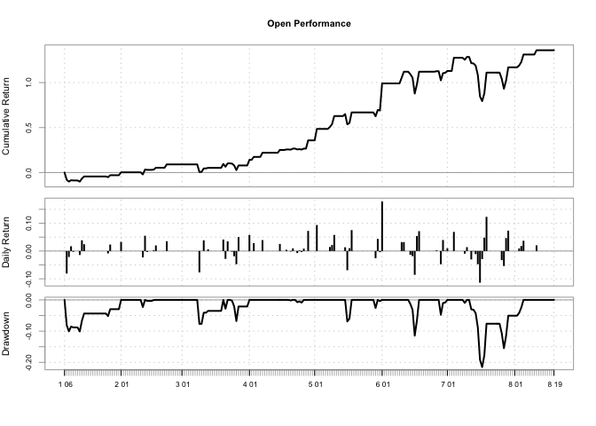
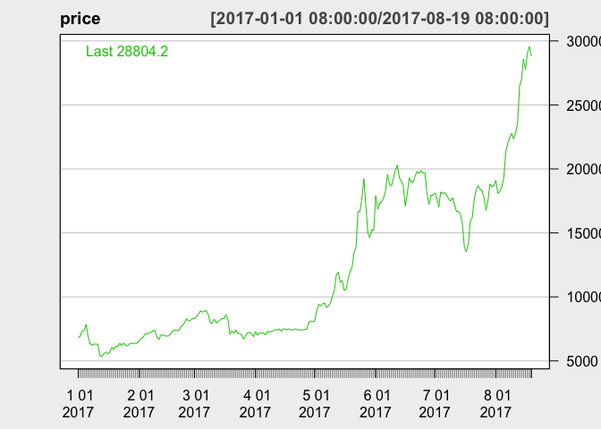

量化实验室之1——基础篇
================
dingchong
2017/8/19

概述：投资策略回测
==================

-   通过云币网接口获取交易信息
-   尝试一个最简单的策略-低买高卖
-   基于历史数据，回测策略的收益率

获取基础数据
============

-   云币网的api限制了单次请求的数据量，所以每次取1天的分时数据，然后循环

``` r
library(jsonlite)

## 接口调试
market <- fromJSON("https://yunbi.com//api/v2/markets.json")
head(market)

ticker <- market[1,1];ticker
fromDate <- as.Date('2017-01-01')

## 单品种单周期获取函数
api.yunbi.price.hour <- function( ticker, fromDate ) {
# 获取单个产品，从fromdate开始30天数据
# 接口信息 https://yunbi.com/swagger/#!/default/GET_version_k_format

  fromDate <- as.numeric(as.POSIXct(fromDate))
  
  idata<- fromJSON( paste(
    "https://yunbi.com//api/v2/k.json?", 
    "market=", ticker,  
    "&limit=24",
    "&period=60", # step by minutes, hour 
    "&timestamp=", fromDate , 
    sep ="") )
  
  idata <- as.data.frame(idata)
  names(idata) <- c('at','open','high', 'low', 'close','vol')
  idata$at <- as.POSIXct(idata$at, origin="1970-01-01")
  
  return(idata)
}

## 单品种多周期循环函数
get.ticker.data <- function( ticker, fromDate) {

  Sys.sleep( abs(rnorm(1,mean = 0.05, sd = 0.05)))
# cut fromDate duration into peices of  days, for limits of api 
  cutdate <- seq( fromDate, Sys.Date(), 1)

# get all dates data   
  idata <- data.frame()
  for( i in 1:(length( cutdate ))) {
    
    a <- api.yunbi.price.hour(ticker, cutdate[i] )
    idata <- rbind(a,idata)
  }
  idata <- unique(idata)
  idata <- idata[ order(idata$at), ]
  idata <- idata[ -nrow(idata), ] # 当天数据不取，最多取前一天
  return(idata)
  
}

## 数据批量获取
btccny <- get.ticker.data( ticker, fromDate)
summary(btccny)
```

-   上面是代码展示，实际数据已经存在数据库里，下面取出来看一下

``` r
library(RMySQL)
con <- dbConnect(MySQL(),user="dish",password="1m1nd1",dbname="stock")
dbSendQuery(con,'SET NAMES utf8')
```

    <MySQLResult:34891912,0,0>

``` r
# dbListTables(con)
# dbWriteTable( con, "ods_yunbi_btc_2017_hour", btccny, 
#              append=T , row.names=FALSE )
dbGetQuery(con, "select * from ods_yunbi_btc_2017_hour limit 10")
```

                        at    open    high     low   close     vol
    1  2017-01-01 08:00:00 6830.00 6834.17 6802.75 6832.00 30.1833
    2  2017-01-01 09:00:00 6831.99 6832.00 6800.01 6815.99 12.3531
    3  2017-01-01 10:00:00 6815.99 6826.82 6802.60 6815.23 39.0076
    4  2017-01-01 11:00:00 6816.30 6823.02 6812.66 6812.66 42.9373
    5  2017-01-01 12:00:00 6812.66 6814.28 6793.95 6809.47 21.9309
    6  2017-01-01 13:00:00 6808.44 6822.05 6804.20 6818.00 35.8841
    7  2017-01-01 14:00:00 6818.00 6838.39 6812.00 6835.00 73.8916
    8  2017-01-01 15:00:00 6835.00 6841.11 6821.18 6825.86 35.6838
    9  2017-01-01 16:00:00 6825.86 6832.51 6822.29 6829.06 55.0257
    10 2017-01-01 17:00:00 6828.97 6835.73 6821.83 6828.11 28.8473

``` r
btc <- dbGetQuery(con, "select * from ods_yunbi_btc_2017_hour ")
dbDisconnect(con)
```

    [1] TRUE

``` r
rm(con)
```

建立策略数据基准
================

-   策略就是if 条件 then 执行，这里应用最简单的
-   条件是一个A比较B的逻辑
-   A就用每天的开盘价格
-   B是5日均线，每天的价格基于成交量加权
-   执行也很简单，只有买或者卖

``` r
library(quantmod)
library(PerformanceAnalytics)

btc$price_volume <- btc$open * btc$vol

# 投资标的价格-每小时价，去掉时间戳，转换成xts
btc.xts <- xts( btc[,-1], 
                order.by = as.POSIXct(btc$at, origin="1970-01-01"))

# 小时数据汇总到天，取open价格
btc.day <- period.apply(btc.xts, 
                    endpoints(btc.xts,"days"),
                    function(xx){
                      ticks=coredata(xx$open)
                      c( first(ticks),max(ticks), min(ticks),
                         last(ticks),
                         sum(xx$vol),sum(xx$price_volume)/sum(xx$vol) )
                    })

colnames(btc.day) <- c("Open","High","Low","Close","Volume","wPrice")
# 时间标记要从分钟改成按天
index(btc.day) <- as.Date( index(btc.day))
head(btc.day)
```

                  Open    High     Low   Close    Volume   wPrice
    2017-01-01 6830.00 6937.36 6808.44 6937.36  693.6553 6853.236
    2017-01-02 6936.50 7353.55 6936.50 7338.00 1261.1969 7207.555
    2017-01-03 7363.93 7451.48 7329.03 7334.75 2360.0009 7385.315
    2017-01-04 7348.18 7951.17 7331.24 7865.00 2673.1125 7643.002
    2017-01-05 7854.40 8830.50 6601.50 6620.89 4929.1389 8122.824
    2017-01-06 6908.15 7319.11 6108.01 6217.34 5836.6892 6677.508

``` r
# 标的价格，条件的左半边
price <- btc.day$Open

# 基准价格，条件的右半边
baseline <- btc.day$wPrice
# 5天移动平均线
mv5 <- SMA(baseline, 5)
```

策略规则
========

-   策略是当收盘价大于5日均线
-   代表可以入市，取1，否则代表清仓，取0。（-1是代表卖空，不适用。）
-   以上回测策略的隐含前提：
-   1.  入市价格和清仓价格均为前一天的收盘价。

-   1.  入市则全部满仓，离市则全部清仓。

-   使用Lag()将信号序列向“过去”推迟一天，代表将昨天的信号，应用到今天。

``` r
sig <- ifelse(price < mv5, 1, 0)
sig <- Lag(sig) #将该序列向“过去”延迟一天
```

策略评价
========

### 计算收益序列

-   discrete代表用离散方式计算当天收益率，即(Close-Close(-1))/Close(-1)
-   continous代表用连续方式计算当天收益率，即ln(Close/Close(-1))

``` r
roc <- ROC(type='discrete',price) # TTR函数
ret <- roc * sig
```

### 画出策略收益图并对比价格本身情况

-   最上面的板块是积累收益，相当于对cumprod(1+ret)的绘图；
-   第二个是日收益，相当于对ret原始收益数据的绘图；
-   最下面的是下跌图（又称“水下图”），将下跌成分独立绘出，有助于我们分析亏损状况和研究弥补措施
-   最后结合实际价格的变化对比，分析原因

``` r
charts.PerformanceSummary(ret)
```



``` r
candleChart( price, theme ='white' )
```



### 收益评价

-   投资者总资产在回测时间内的增减情况,也就是对（1+ret）的连乘

``` r
roi <- 1+ ifelse( is.na(ret), 0, ret )
cumprod( roi)[ length(roi)]
```

    [1] 2.35971

### 定位亏损日期，分析原因，略

ref
===

[siloes,2015](http://www.jianshu.com/p/a0c33f1fa04b) [接口信息](https://yunbi.com/swagger/#!/default/GET_version_k_format)
