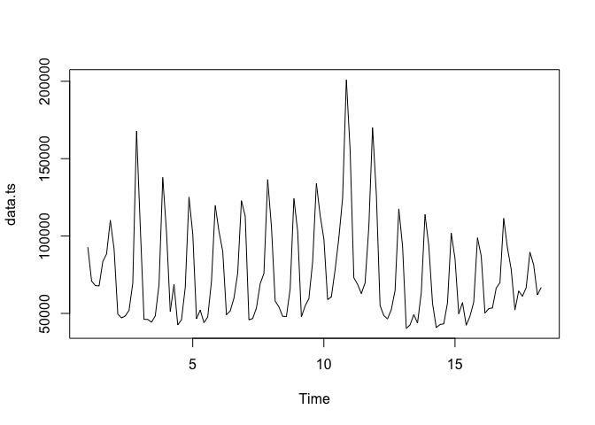
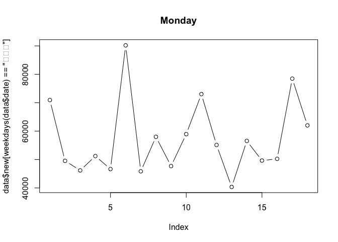
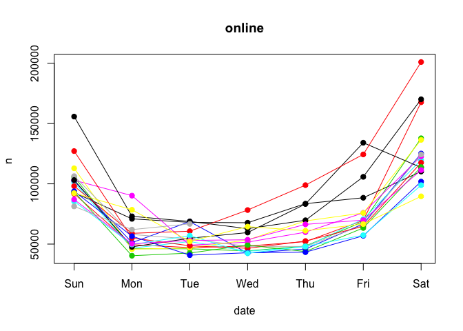
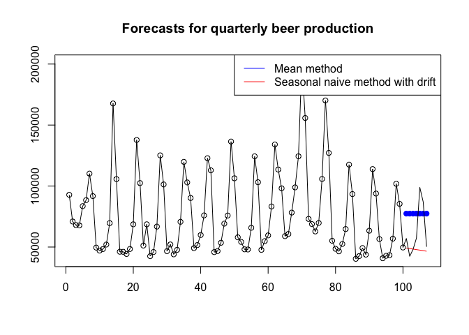
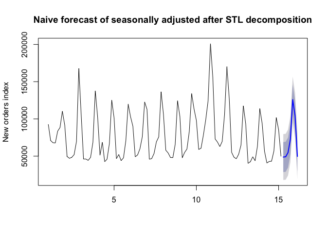
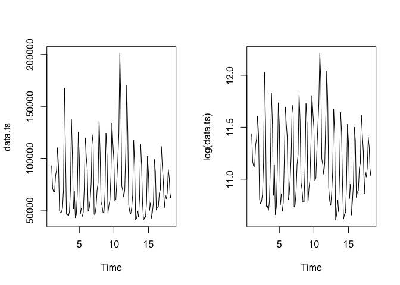
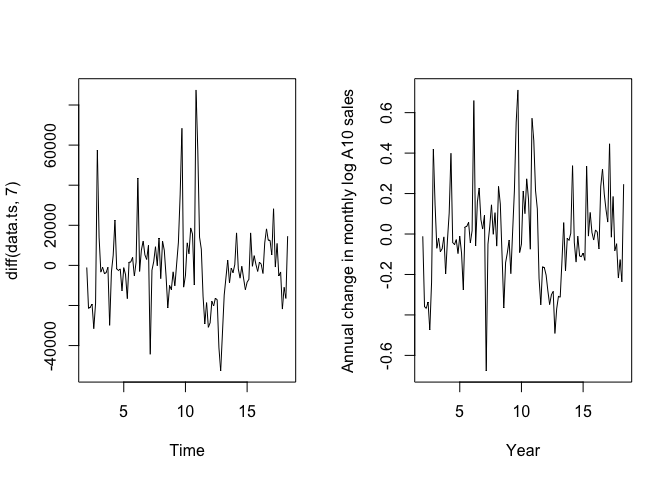
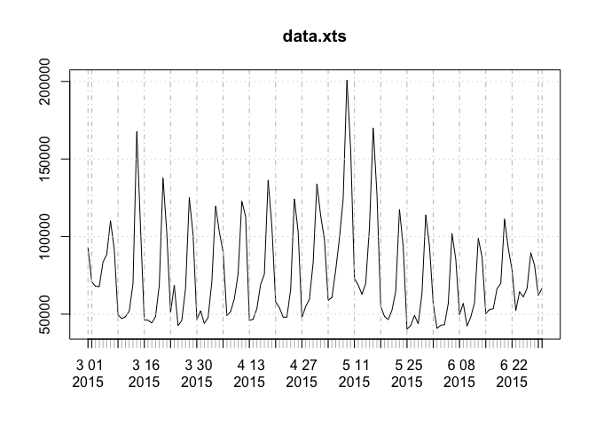

timeSeriseAll
================
tedding
June 15, 2016

Environment settings

``` r
setwd(
'/Users/dingchong/github/Data-Science-in-R/11.Time Series Analysis')
#dir <- iconv(rstudioapi::getActiveDocumentContext()$path, 'utf8','gbk') # win
#dir <- rstudioapi::getActiveDocumentContext()$path # mac
#dir <- substr(dir, 1,
#              gregexpr( '/', dir)[[1]][ length(gregexpr( '/', dir)[[1]])] )
# setwd(dir)

data <- read.csv('tdata1.csv', header = T )
data[,1] = as.Date( data[,1])
head(data)
```

    ##         date   new     log income
    ## 1 2015-03-01 71383 2666169  745.0
    ## 2 2015-03-02 54572 2192393  580.3
    ## 3 2015-03-03 52306 2147821  539.1
    ## 4 2015-03-04 52093 2162540  552.1
    ## 5 2015-03-05 64262 2392343  624.5
    ## 6 2015-03-06 68040 2522522  742.6

data fromation
==============

ts is the basic format of time series data in R, zoo&xts are enhanced ones.

``` r
data.ts = ts( data$new , frequency = 7 )
plot(data.ts)
```

 [ts - frequncey](http://robjhyndman.com/hyndsight/seasonal-periods/%5D,the%20“frequency”%20is%20the%20number%20of%20observations%20per%20season.%20Here%20I%20think%20it%20means%207%20data%20comes%20to%20a%20week%20unit.)

xts way

``` r
library(xts)
```

    ## Loading required package: zoo

    ## Warning: package 'zoo' was built under R version 3.2.5

    ## 
    ## Attaching package: 'zoo'

    ## The following objects are masked from 'package:base':
    ## 
    ##     as.Date, as.Date.numeric

``` r
data.xts = xts( data$new,  data$date) # , frequency = 7
plot(data.xts)
```


view of the data
================

extract some time

``` r
plot( data$new[ months(data$date) == '三月' ], type = 'b', main ='March')
```


``` r
plot( data$new[ weekdays(data$date) == '星期一' ], type = 'b', main ='Monday')
```



considering the week days

``` r
library(forecast)
```

    ## Warning: package 'forecast' was built under R version 3.2.5

    ## Loading required package: timeDate

    ## This is forecast 7.3

``` r
seasonplot( data[,2] , ylab="n ", xlab="date", main="online", 
           s = 7, year.labels=F, year.labels.left=F, col=1:10, pch=19)
```



``` r
# here s means the same as frequency of ts
# monthplot( data[,2] ,ylab="xx",xlab="Month",main="Seasonal deviation plot")
```

extract and transform
=====================

Time series decomposition
-------------------------

A trend exists when there is a long-term increase or decrease in the data. A seasonal pattern occurs when a time series is affected by seasonal factors such as the time of the year or the day of the week. A cycle occurs when the data exhibit rises and falls that are not of a fixed period.

classic decomposition

``` r
plot( decompose( data.ts, type="multiplicative") )
```


week effect
-----------

``` r
summary( aov( data$new ~ weekdays(data$date) ))
```

    ##                      Df    Sum Sq   Mean Sq F value Pr(>F)    
    ## weekdays(data$date)   6 5.019e+10 8.365e+09   44.48 <2e-16 ***
    ## Residuals           115 2.163e+10 1.881e+08                   
    ## ---
    ## Signif. codes:  0 '***' 0.001 '**' 0.01 '*' 0.05 '.' 0.1 ' ' 1

``` r
effect.week = aggregate( data$new, by = list(weekday= weekdays(data$date)), mean)
effect.week$x = effect.week$x/ min(effect.week$x)
effect.week
```

    ##   weekday        x
    ## 1  星期二 1.025819
    ## 2  星期六 2.403244
    ## 3  星期日 1.924839
    ## 4  星期三 1.000000
    ## 5  星期四 1.135690
    ## 6  星期五 1.472423
    ## 7  星期一 1.081804

outlier detection - tsoutliers
------------------------------

-   IO innovational outlier
-   AO additive outlier
-   LS level shift
-   TC temporary change
-   SLS seasonal level shift

``` r
# install.packages(‘tsoutliers’)

library("tsoutliers")
```

    ## Warning: package 'tsoutliers' was built under R version 3.2.5

``` r
data(Nile)
resNile1 <- tso(y = Nile, types = c("AO", "LS", "TC"),
                tsmethod = "stsm", args.tsmodel = list(model = "local-level"))
```

    ## Warning in sqrt(diag(solve(res$hessian))): 产生了NaNs

    ## Warning in sqrt(diag(solve(res$hessian))): 产生了NaNs

    ## Warning in sqrt(diag(solve(res$hessian))): 产生了NaNs

    ## Warning in sqrt(diag(solve(res$hessian))): 产生了NaNs

    ## Warning in sqrt(diag(solve(res$hessian))): 产生了NaNs

``` r
plot(resNile1)
```


``` r
resNile2 <- tso(y = Nile, types = c("AO", "LS", "TC"),
                remove.method = "bottom-up", tsmethod = "auto.arima",
                cval = 1.5 ,  # between 3-4, less more points
                args.tsmethod = list(allowdrift = FALSE, ic = "bic"))
```

    ## Warning in locate.outliers.iloop(resid = resid, pars = pars, cval = cval, :
    ## stopped when 'maxit.iloop' was reached

    ## Warning in locate.outliers.iloop(resid = resid, pars = pars, cval = cval, :
    ## stopped when 'maxit.iloop' was reached

    ## Warning in locate.outliers.iloop(resid = resid, pars = pars, cval = cval, :
    ## stopped when 'maxit.iloop' was reached

    ## Warning in locate.outliers.oloop(y = y, fit = fit, types = types, cval =
    ## cval, : stopped when 'maxit.oloop = 4' was reached

``` r
resNile2
```

    ## Series: Nile 
    ## ARIMA(0,0,0) with non-zero mean 
    ## 
    ## Coefficients:
    ##       intercept        AO3       TC4        AO7       AO9      LS13
    ##       1081.8958  -118.8958  138.7544  -316.4886  264.7837  -81.3426
    ## s.e.    30.8154    75.5750   68.6637    72.8037   73.2903   39.7704
    ##           LS20       TC27       LS29      AO33     TC38       AO43
    ##       182.5645  -111.4912  -379.5446  149.5392  238.341  -387.2607
    ## s.e.   36.3300    55.3298    27.3405   70.2456   53.451    70.1579
    ##           TC46       AO55      AO59      TC64       TC70      AO76
    ##       259.7246  -116.6033  233.7785  187.2387  -132.6662  249.4371
    ## s.e.   53.4059    70.0650   70.1539   53.3130    53.2121   70.0220
    ##           LS84       AO87      AO94       TC96       LS98
    ##       139.3167  -145.6325  227.1314  -142.0429  -168.0773
    ## s.e.   25.2003    72.3425   72.3426    60.9773    46.4510
    ## 
    ## sigma^2 estimated as 6184:  log likelihood=-565.31
    ## AIC=1178.63   AICc=1194.63   BIC=1241.15
    ## 
    ## Outliers:
    ##    type ind time coefhat   tstat
    ## 1    AO   3 1873 -118.90  -1.573
    ## 2    TC   4 1874  138.75   2.021
    ## 3    AO   7 1877 -316.49  -4.347
    ## 4    AO   9 1879  264.78   3.613
    ## 5    LS  13 1883  -81.34  -2.045
    ## 6    LS  20 1890  182.56   5.025
    ## 7    TC  27 1897 -111.49  -2.015
    ## 8    LS  29 1899 -379.54 -13.882
    ## 9    AO  33 1903  149.54   2.129
    ## 10   TC  38 1908  238.34   4.459
    ## 11   AO  43 1913 -387.26  -5.520
    ## 12   TC  46 1916  259.72   4.863
    ## 13   AO  55 1925 -116.60  -1.664
    ## 14   AO  59 1929  233.78   3.332
    ## 15   TC  64 1934  187.24   3.512
    ## 16   TC  70 1940 -132.67  -2.493
    ## 17   AO  76 1946  249.44   3.562
    ## 18   LS  84 1954  139.32   5.528
    ## 19   AO  87 1957 -145.63  -2.013
    ## 20   AO  94 1964  227.13   3.140
    ## 21   TC  96 1966 -142.04  -2.329
    ## 22   LS  98 1968 -168.08  -3.618

``` r
plot(resNile2)
```


simple way of forecast framework (too simple to use)
====================================================

means
-----

forecasting methods and evaluation
rwf: Returns forecasts and prediction intervals for a random walk with drift model applied to x.

``` r
f.meanf <- meanf(data.ts[1:100],h=7)
f.rwf <- rwf( data.ts[1:100], drift = T ,h=7)

plot( f.meanf, plot.conf=FALSE, main="Forecasts for quarterly beer production")
lines( f.rwf$mean,col=2)
lines( 1:107, data.ts[1:107] )
legend("topright", lty=1, col=c(4,2),
       legend=c("Mean method", "Seasonal naive method with drift"))
```



``` r
accuracy( f.meanf, data.ts[101:107] )  
```

    ##                         ME     RMSE      MAE       MPE     MAPE      MASE
    ## Training set  2.400515e-12 25865.25 21248.69 -16.89007 38.84926 1.0000000
    ## Test set     -1.108024e+04 18824.13 17908.02 -33.64294 42.99911 0.8427823

``` r
accuracy( f.rwf, data.ts[101:107] )
```

    ##                         ME     RMSE      MAE       MPE     MAPE      MASE
    ## Training set -2.574461e-13 26154.62 19409.61 -8.132422 32.80620 1.0015368
    ## Test set      1.161644e+04 19385.20 13064.55 17.127669 21.55556 0.6741311
    ##                   ACF1
    ## Training set 0.1198494
    ## Test set            NA

``` r
### Mean absolute error
### Root mean squared error
```

Moving averages cannot used for forecast

STL decomposition
-----------------

Seasonal and Trend decomposition using Loess seasonally adjusted data and re-seasonalizing using the last year of the seasonal component.

``` r
stl <- stl( data.ts, s.window = 'periodic' )
plot( stl ) # difference between decompose ???
```


``` r
plot( data.ts , col="gray", main="Exx", ylab="New orders index", xlab="")
lines( stl$time.series[,2],col="red",ylab="Trend")
```


The two main parameters to be chosen when using STL are the trend window (t.window) and seasonal window (s.window), These control how rapidly the trend and seasonal components can change. Small values allow more rapid change. Setting the seasonal window to be infinite is equivalent to forcing the seasonal component to be periodic (i.e., identical across years).

``` r
model.stl <- stl( ts(data$new[1:100], frequency = 7) ,
               t.window=7, s.window="periodic", robust=TRUE)
f.stl <- forecast(model.stl, method="naive", h = 7)
plot( f.stl, ylab="New orders index", 
     main = "Naive forecast of seasonally adjusted after STL decomposition")
```



``` r
accuracy( f.stl, data.ts[101:107] )
```

    ##                       ME     RMSE      MAE        MPE     MAPE      MASE
    ## Training set    90.93827 12104.13 7755.973  -0.848014 13.17728 0.4002085
    ## Test set     -7058.15122 10970.20 9004.014 -12.569888 17.04674 0.4646075
    ##                    ACF1
    ## Training set -0.2121731
    ## Test set             NA

Arima models
============

Stationarity and differencing
-----------------------------

``` r
par(mfrow =c(1,2))
plot( data.ts)
plot( log(data.ts))
```



``` r
plot( diff(data.ts, 7))
plot(diff(log(data.ts),7), xlab="Year",
  ylab="Annual change in monthly log A10 sales")
```



``` r
par(mfrow=c(1,1))
tsdisplay(diff( data.ts ,7))
```


``` r
library(tseries)
```

    ## Warning: package 'tseries' was built under R version 3.2.5

``` r
adf.test(data.ts, alternative = "stationary")
```

    ## Warning in adf.test(data.ts, alternative = "stationary"): p-value smaller
    ## than printed p-value

    ## 
    ##  Augmented Dickey-Fuller Test
    ## 
    ## data:  data.ts
    ## Dickey-Fuller = -5.967, Lag order = 4, p-value = 0.01
    ## alternative hypothesis: stationary

Large p-values are indicative of non-stationarity, and small p-values suggest stationarity. Using the usual 5% threshold, differencing is required if the p-value is greater than 0.05. Sometimes it is just not possible to find a model that passes all the tests.

general arima
-------------

ARIMA(p,d,q) model

-   p= order of the autoregressive part;
-   d= degree of first differencing involved;
-   q= order of the moving average part.

some simple arima models

-   White noise ARIMA(0,0,0)
-   Random walk ARIMA(0,1,0) with no constant
-   Random walk with drift ARIMA(0,1,0) with a constant
-   Autoregression ARIMA(p,0,0)
-   Moving average ARIMA(0,0,q) \#\# modelling procedure 1.Plot the data. Identify any unusual observations.
    2.If necessary, transform the data (using a Box-Cox transformation) to stabilize the variance.
    3.If the data are non-stationary: take first differences of the data until the data are stationary.
    4.Examine the ACF/PACF: Is an AR(pp) or MA(qq) model appropriate?
    5.Try your chosen model(s), and use the AICc to search for a better model.
    6.Check the residuals from your chosen model by plotting the ACF of the residuals, and doing a portmanteau test of the residuals. If they do not look like white noise, try a modified model.
    7.Once the residuals look like white noise, calculate forecasts.

example from book :

``` r
library(fpp) # for data source
```

    ## Loading required package: fma

    ## Warning: package 'fma' was built under R version 3.2.5

    ## Loading required package: expsmooth

    ## Loading required package: lmtest

    ## Warning: package 'lmtest' was built under R version 3.2.5

``` r
eeadj <- seasadj(stl(elecequip, s.window="periodic"))
plot(eeadj)
```


1.The big drop in 2008/2009 due to the global economic environment. Otherwise there is nothing unusual about the time plot and there appears to be no need to do any data adjustments. 2.There is no evidence of changing variance, so we will not do a Box-Cox transformation. 3.The data are clearly non-stationary . Consequently, we will take a first difference of the data. These look stationary, and so we will not consider further differences.

``` r
tsdisplay(diff(eeadj),main="")
```

 4.The PACF shown above suggests an AR(3) model. So an initial candidate model is an ARIMA(3,1,0). There are no other obvious candidate models. 5.We fit an ARIMA(3,1,0) model along with variations including ARIMA(4,1,0), ARIMA(2,1,0), ARIMA(3,1,1), etc. Of these, the ARIMA(3,1,1) has a slightly smaller AICc value.

``` r
fit <- Arima(eeadj, order=c(3,1,0))
fit$aic
```

    ## [1] 979.3314

``` r
fit <- Arima(eeadj, order=c(2,1,1))
fit$aic
```

    ## [1] 991.5201

``` r
fit <- Arima(eeadj, order=c(3,1,1))
fit$aic
```

    ## [1] 978.1664

1.  The ACF plot of the residuals from the ARIMA(3,1,1) model shows all correlations within the threshold limits indicating that the residuals are behaving like white noise.

``` r
Acf(residuals(fit))
```


``` r
Box.test(residuals(fit), lag=24, fitdf=4, type="Ljung")
```

    ## 
    ##  Box-Ljung test
    ## 
    ## data:  residuals(fit)
    ## X-squared = 20.496, df = 20, p-value = 0.4273

Box-Ljung statistic has a p-value of 0.9 suggests that the daily change is essentially a random amount uncorrelated with previous days(opposite to normal Hypothesis Testing).

1.  Forecasts from the chosen model are shown in Figure 8.13.

``` r
plot(forecast(fit))
```


Seasonal arima models
---------------------

ARIMA(p,d,q)(P,D,Q)

Quarterly retail trade index in the Euro area (17 countries), 1996?C2011, covering wholesale and retail trade, and repair of motor vehicles and motorcycles.

``` r
plot(euretail, ylab="Retail index", xlab="Year")
```


The data are clearly non-stationary, with some seasonality, so we will first take a seasonal difference.

``` r
tsdisplay(diff(euretail,4))
```


These also appear to be non-stationary, and so we take an additional first difference

``` r
tsdisplay(diff(diff(euretail,4)))
```

 The significant spike at lag 1 in the ACF suggests a non-seasonal MA(1) component, and the significant spike at lag 4 in the ACF suggests a seasonal MA(1) component. Consequently, we begin with an ARIMA(1,1,1)(1,1,1)

``` r
fit <- Arima(euretail, order=c(1,1,1), seasonal=c(1,1,1))
tsdisplay(residuals(fit))
```

 All the spikes are now within the significance limits, and so the residuals appear to be white noise.

``` r
fit.season <- Arima(euretail, order=c(1,1,1), seasonal=c(1,1,1))
res <- residuals(fit.season)
tsdisplay(res)
```


``` r
Box.test(res, lag=16, fitdf=4, type="Ljung")
```

    ## 
    ##  Box-Ljung test
    ## 
    ## data:  res
    ## X-squared = 11.889, df = 12, p-value = 0.4547

prediction

``` r
plot(forecast(fit.season, h=12))
```


We could have used auto.arima() to do most of this work for us.

``` r
auto.arima(euretail)
```

    ## Series: euretail 
    ## ARIMA(1,1,2)(0,1,1)[4]                    
    ## 
    ## Coefficients:
    ##          ar1      ma1     ma2     sma1
    ##       0.7345  -0.4655  0.2162  -0.8413
    ## s.e.  0.2239   0.1995  0.2096   0.1869
    ## 
    ## sigma^2 estimated as 0.1592:  log likelihood=-29.69
    ## AIC=69.37   AICc=70.51   BIC=79.76

auto.arima() takes some short-cuts in order to speed up the computation and will not always give the best model. You can turn the short-cuts off and then it will sometimes return a different model.

``` r
auto.arima(euretail, stepwise=FALSE, approximation=FALSE)
```

    ## Series: euretail 
    ## ARIMA(0,1,3)(0,1,1)[4]                    
    ## 
    ## Coefficients:
    ##          ma1     ma2     ma3     sma1
    ##       0.2625  0.3697  0.4194  -0.6615
    ## s.e.  0.1239  0.1260  0.1296   0.1555
    ## 
    ## sigma^2 estimated as 0.1564:  log likelihood=-28.7
    ## AIC=67.4   AICc=68.53   BIC=77.78

remenber the 1-7 steps? The automated algorithm only takes care of steps 3?C5. So even if you use it, you will still need to take care of the other steps yourself.

how does auto.arima work
------------------------

combines unit root tests, minimization of the AICc and MLE to obtain an ARIMA model. ARIMA(p,d,q) - The number of differences d is determined using repeated KPSS(unit root test) tests. - The values of p and q are then chosen by minimizing the AICc after differencing the data dd times, stepwised. - If d=0 then the constant c is included, or is set to 0.

back to our own data
--------------------

``` r
plot(data.xts) 
```



``` r
train <- ts( log(data$new[1:100]), frequency =7 )

fit <- auto.arima( train, seasonal = T, stepwise=FALSE, approximation=FALSE)
fit
```

    ## Series: train 
    ## ARIMA(1,0,0)(2,0,0)[7] with non-zero mean 
    ## 
    ## Coefficients:
    ##          ar1    sar1    sar2  intercept
    ##       0.5599  0.5221  0.3247    10.8787
    ## s.e.  0.0843  0.0975  0.1031     0.1971
    ## 
    ## sigma^2 estimated as 0.03852:  log likelihood=18.82
    ## AIC=-27.63   AICc=-26.99   BIC=-14.6

``` r
data.forecast <- forecast(fit, h=20)

plot( data.forecast, include =40 )
lines( ts( log( data$new[1:120]), frequency=7 ), col ='red')
legend(x = "topleft", legend = c("Predicted", "Real Data"), 
       col = c("blue", "red"), lty = c(1, 1))
```


``` r
accuracy( data.forecast, data$new[101:120] )
```

    ##                         ME         RMSE          MAE        MPE      MAPE
    ## Training set -8.053632e-03 1.922932e-01 1.404425e-01 -0.1085542  1.289064
    ## Test set      5.311885e+04 5.499932e+04 5.311885e+04 99.9784776 99.978478
    ##                      MASE        ACF1
    ## Training set 4.665348e-01 0.004771361
    ## Test set     1.764551e+05          NA

不知道有什么卵用，暂时堆在这里
==============================

``` r
# 
# library(xts)
# data <- xts( raw[,-1], order.by= raw[,1], frequency =  7)
# plot(data);rm(raw)
# 
# index = which( .indexwday( train )  %in% c(0,6) )
# 
# wkend =   mean( train[ index ] )
# wkday =   mean( train[ -index ] )
# 
# 
# train = window(data, end = '2015-06-30')
# # test = window( data, start = '2015-07-01', end = '2015-07-15')
# test = window( data, start = '2015-07-01' )
# 
# # acf, pacf
# plot( train )
# 
# acf(train )
# pacf( train )
# Box.test(train)
# 
# l =  diff(train)[-1]
# acf(l)
# pacf(l)
# 
# # arima
# library( forecast)
# fit = auto.arima(train )
# 
# fit = arima( train, order = c(2,0,0) )
# 
# fit = arima( train ,order = c(2,0,0), seasonal=list(order=c(0,1,1),period=7) )
# 
# # Exponential smoothing state space model
# fit = ets(  ts(train, frequency = 7) )
# 
# 
# summary(fit)
# plot( forecast( fit, 15))
# 
# 
# # plot.nz(fit)
# fore = xts( forecast( fit, h = length(test) )$mean , order =index(test)  )
# foree = merge(  test, fore  )
# plot(as.zoo(foree), main = paste( fit$arma, collapse = "") , 
#      screens=1, col=c("blue","red"), lty = c("solid","dotted") )
# legend( "topleft", legend = c("real","fore"), col = c("blue","red"), lty = c("solid","dotted"))
# 
# round( (colSums( foree[,1])- colSums( foree[,2])) /colSums( foree[,1]), 2)
```

filter
------

``` r
# 
# effect.week = aggregate( data$new, by = list(weekday= weekdays(data$date)), mean)
# effect.week$x = effect.week$x/ min(effect.week$x)
# effect.week
# 
# 
# data1 <- data
# for( i in 1:nrow(effect.week) ) {
#   ind <- effect.week$weekday[i]
#   data1$nv[weekdays(data$date) == ind] <- 
#     data$new[ weekdays(data$date) == ind ]/effect.week$x[i]
# }
# 
# data1
# aindexb <- function(x,y) { value = ifelse( weekdays(x$date)== y$weekday, 
#                                    x$new/y$)}
# 
# data.ts.week
```

``` r
knitr::kable(mtcars)
```

|                     |   mpg|  cyl|   disp|   hp|  drat|     wt|   qsec|   vs|   am|  gear|  carb|
|---------------------|-----:|----:|------:|----:|-----:|------:|------:|----:|----:|-----:|-----:|
| Mazda RX4           |  21.0|    6|  160.0|  110|  3.90|  2.620|  16.46|    0|    1|     4|     4|
| Mazda RX4 Wag       |  21.0|    6|  160.0|  110|  3.90|  2.875|  17.02|    0|    1|     4|     4|
| Datsun 710          |  22.8|    4|  108.0|   93|  3.85|  2.320|  18.61|    1|    1|     4|     1|
| Hornet 4 Drive      |  21.4|    6|  258.0|  110|  3.08|  3.215|  19.44|    1|    0|     3|     1|
| Hornet Sportabout   |  18.7|    8|  360.0|  175|  3.15|  3.440|  17.02|    0|    0|     3|     2|
| Valiant             |  18.1|    6|  225.0|  105|  2.76|  3.460|  20.22|    1|    0|     3|     1|
| Duster 360          |  14.3|    8|  360.0|  245|  3.21|  3.570|  15.84|    0|    0|     3|     4|
| Merc 240D           |  24.4|    4|  146.7|   62|  3.69|  3.190|  20.00|    1|    0|     4|     2|
| Merc 230            |  22.8|    4|  140.8|   95|  3.92|  3.150|  22.90|    1|    0|     4|     2|
| Merc 280            |  19.2|    6|  167.6|  123|  3.92|  3.440|  18.30|    1|    0|     4|     4|
| Merc 280C           |  17.8|    6|  167.6|  123|  3.92|  3.440|  18.90|    1|    0|     4|     4|
| Merc 450SE          |  16.4|    8|  275.8|  180|  3.07|  4.070|  17.40|    0|    0|     3|     3|
| Merc 450SL          |  17.3|    8|  275.8|  180|  3.07|  3.730|  17.60|    0|    0|     3|     3|
| Merc 450SLC         |  15.2|    8|  275.8|  180|  3.07|  3.780|  18.00|    0|    0|     3|     3|
| Cadillac Fleetwood  |  10.4|    8|  472.0|  205|  2.93|  5.250|  17.98|    0|    0|     3|     4|
| Lincoln Continental |  10.4|    8|  460.0|  215|  3.00|  5.424|  17.82|    0|    0|     3|     4|
| Chrysler Imperial   |  14.7|    8|  440.0|  230|  3.23|  5.345|  17.42|    0|    0|     3|     4|
| Fiat 128            |  32.4|    4|   78.7|   66|  4.08|  2.200|  19.47|    1|    1|     4|     1|
| Honda Civic         |  30.4|    4|   75.7|   52|  4.93|  1.615|  18.52|    1|    1|     4|     2|
| Toyota Corolla      |  33.9|    4|   71.1|   65|  4.22|  1.835|  19.90|    1|    1|     4|     1|
| Toyota Corona       |  21.5|    4|  120.1|   97|  3.70|  2.465|  20.01|    1|    0|     3|     1|
| Dodge Challenger    |  15.5|    8|  318.0|  150|  2.76|  3.520|  16.87|    0|    0|     3|     2|
| AMC Javelin         |  15.2|    8|  304.0|  150|  3.15|  3.435|  17.30|    0|    0|     3|     2|
| Camaro Z28          |  13.3|    8|  350.0|  245|  3.73|  3.840|  15.41|    0|    0|     3|     4|
| Pontiac Firebird    |  19.2|    8|  400.0|  175|  3.08|  3.845|  17.05|    0|    0|     3|     2|
| Fiat X1-9           |  27.3|    4|   79.0|   66|  4.08|  1.935|  18.90|    1|    1|     4|     1|
| Porsche 914-2       |  26.0|    4|  120.3|   91|  4.43|  2.140|  16.70|    0|    1|     5|     2|
| Lotus Europa        |  30.4|    4|   95.1|  113|  3.77|  1.513|  16.90|    1|    1|     5|     2|
| Ford Pantera L      |  15.8|    8|  351.0|  264|  4.22|  3.170|  14.50|    0|    1|     5|     4|
| Ferrari Dino        |  19.7|    6|  145.0|  175|  3.62|  2.770|  15.50|    0|    1|     5|     6|
| Maserati Bora       |  15.0|    8|  301.0|  335|  3.54|  3.570|  14.60|    0|    1|     5|     8|
| Volvo 142E          |  21.4|    4|  121.0|  109|  4.11|  2.780|  18.60|    1|    1|     4|     2|

Note that the `echo = FALSE` parameter was added to the code chunk to prevent printing of the R code that generated the plot.

<https://www.otexts.org/fpp/6/3>
