ggplot2
================
dingchong
August 30, 2015

ggplot2
=======

单变量
------

``` r
library(ggplot2)
```

    ## Warning: package 'ggplot2' was built under R version 3.2.5

``` r
# area plot
sunspotyear <- data.frame( 
  year = as.numeric( time(sunspot.year)), 
  sunspots = as.numeric(sunspot.year))
ggplot( sunspotyear, aes( x=year, y=sunspots)) +
  geom_area( color="black", fill="blue", alph = 0.9 ) + # alph透明度
  geom_line()
```

    ## Warning: Ignoring unknown parameters: alph

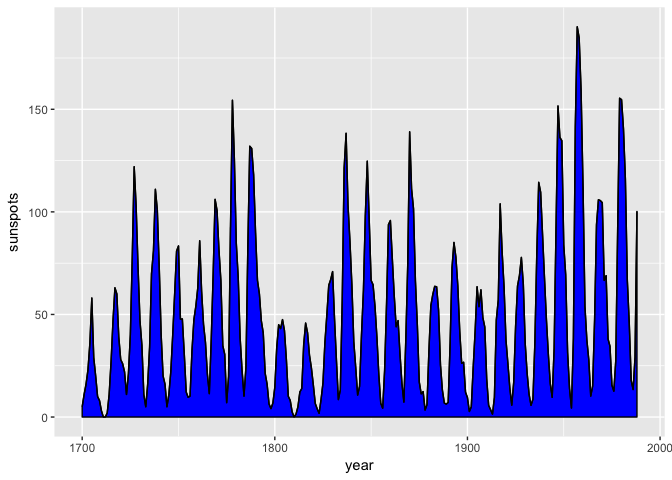

分组密度曲线
============

``` r
library(MASS)
birthwt1 <- birthwt
birthwt1$smoke <- factor( birthwt1$smoke )
ggplot( birthwt1, aes( x = bwt, color=smoke)) + geom_density( alpha = 0.3)
```

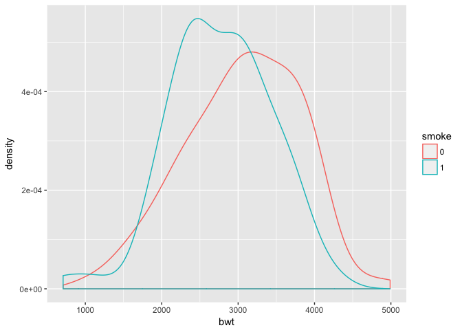

三变量: 2数值 + 1分类
---------------------

``` r
# data prepare
library(reshape2)
```

    ## Warning: package 'reshape2' was built under R version 3.2.5

``` r
## Simulate some data

## 3 Factor Variables
FacVar1=as.factor(rep(c("level1","level2"),25))
FacVar2=as.factor(rep(c("levelA","levelB","levelC"),17)[-51])
FacVar3=as.factor(rep(c("levelI","levelII","levelIII","levelIV"),13)[-c(51:52)])

## 4 Numeric Vars
set.seed(123)
NumVar1=round(rnorm(n=50,mean=1000,sd=50),digits=2) ## Normal distribution
set.seed(123)
NumVar2=round(runif(n=50,min=500,max=1500),digits=2) ## Uniform distribution
set.seed(123)
NumVar3=round(rexp(n=50,rate=.001)) ## Exponential distribution
NumVar4=2001:2050

simData=data.frame(FacVar1,FacVar2,FacVar3,NumVar1,NumVar2,NumVar3,NumVar4)
## Mean of 1 Numeric over levels of two factor vars
meanaggg = aggregate(simData$NumVar1, list(simData$FacVar1, simData$FacVar2), mean)
```

``` r
## 3维：2维连续变量+1维分类变量用颜色表示
ggplot(simData,aes(x=NumVar1,y=NumVar2,color=FacVar1))+geom_point()
```

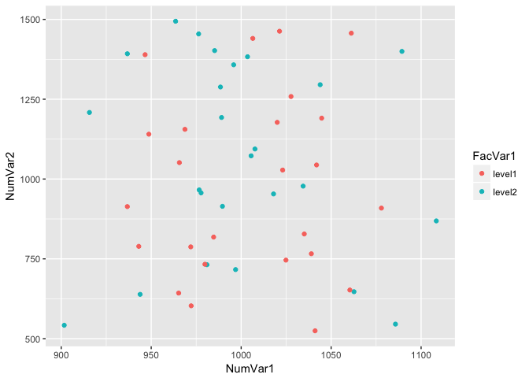

``` r
## 3维度：1维数值，1维时间+1维分类用颜色表示
simtmpp=simData[,c(4,5,7)]
simtmppmelt=melt(simtmpp,id=c("NumVar4"))
ggplot(simtmppmelt,aes(x=NumVar4,y=value,color=variable,group=variable))+
  geom_point()+geom_line()
```

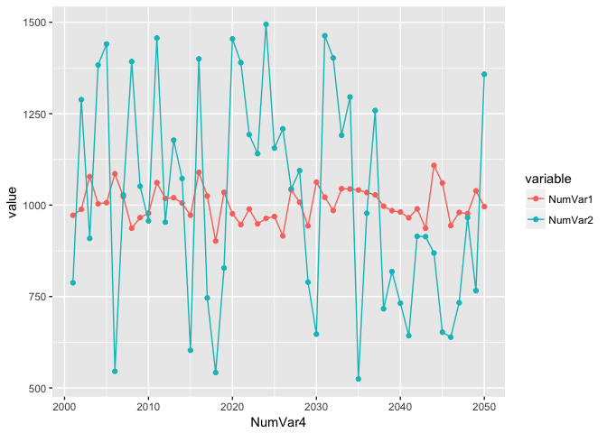

``` r
## 类似的，面积堆积图
ggplot(simtmppmelt,aes(x=NumVar4,y=value,fill=variable)) + 
  geom_area(position="stack")
```

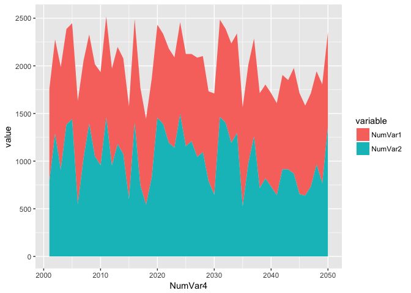

``` r
## Extra: 100% stacked area graph
ggplot(simtmppmelt,aes(x=NumVar4,y=value,fill=variable)) +
  geom_area(position="fill")
```

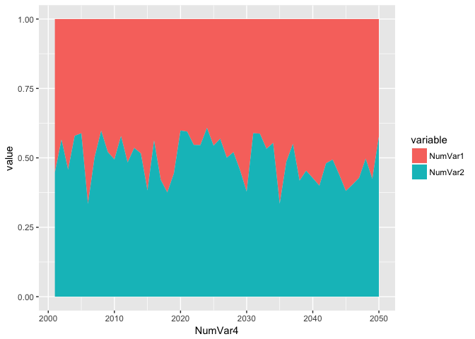

三变量: 1数值 + 2分类
---------------------

``` r
## boxplot：1维数值，1维x轴 ，1维颜色
ggplot(simData,aes(x=FacVar2,y=NumVar1, fill=FacVar1))+geom_boxplot()
```

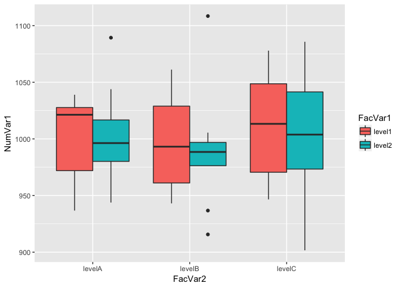

``` r
## Interaction chart - line chart
## 可反映不同因素的交互作用影响
ggplot(meanaggg,aes(x=Group.2,y=x,color=Group.1, group=Group.1)) +
  geom_point()+geom_line()
```

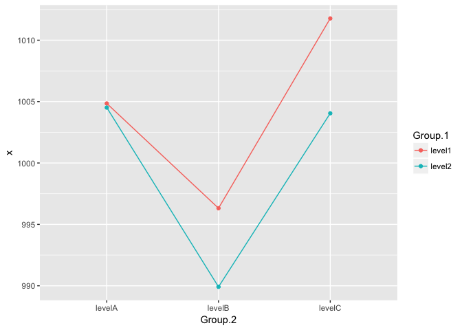

三变量: 3数值
-------------

``` r
# Bubble plot - scatter plot of NumVar1 and NumVar2 
# with individual observations sized by NumVar3
ggplot(simData,aes(x=NumVar1,y=NumVar2,size=NumVar3))+geom_point()
```

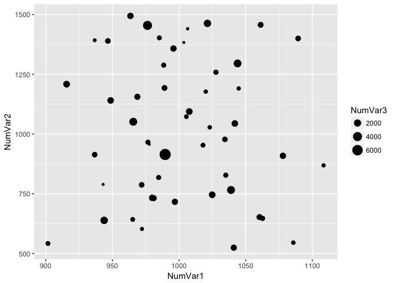

``` r
# 大量点的堆: 分块密度-颜色
sp <- ggplot( diamonds, aes( x =carat, y= price ))
sp + stat_bin2d( bins = 50 ) + 
  scale_fill_gradient( low = "lightblue", high = "red", limits=c(0,6000) )
```

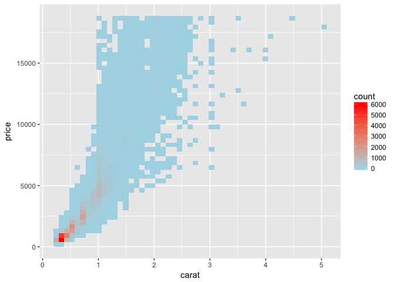

``` r
# 等高线表示点的密度
p = ggplot( faithful, aes(x = eruptions,  y = waiting ))
p + geom_point() + stat_density2d( )
```

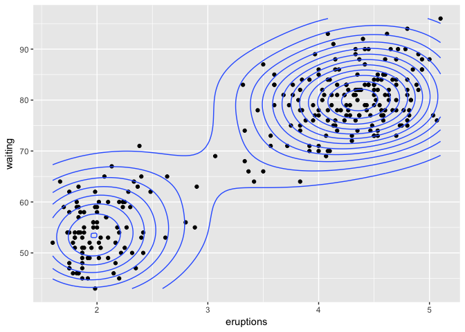

``` r
p + stat_density2d( aes(colour = ..level..) )
```

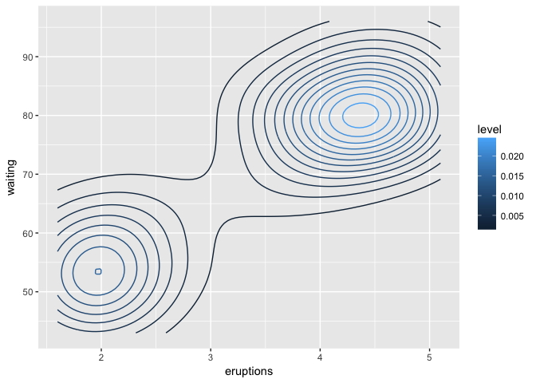

四维
----

``` r
# 多变量图：颜色、面积
head(iris)
```

    ##   Sepal.Length Sepal.Width Petal.Length Petal.Width Species
    ## 1          5.1         3.5          1.4         0.2  setosa
    ## 2          4.9         3.0          1.4         0.2  setosa
    ## 3          4.7         3.2          1.3         0.2  setosa
    ## 4          4.6         3.1          1.5         0.2  setosa
    ## 5          5.0         3.6          1.4         0.2  setosa
    ## 6          5.4         3.9          1.7         0.4  setosa

``` r
ggplot( iris, aes( x = Petal.Width, y = Sepal.Width, 
                   size = Sepal.Length , color = Species)) + 
  geom_point()
```

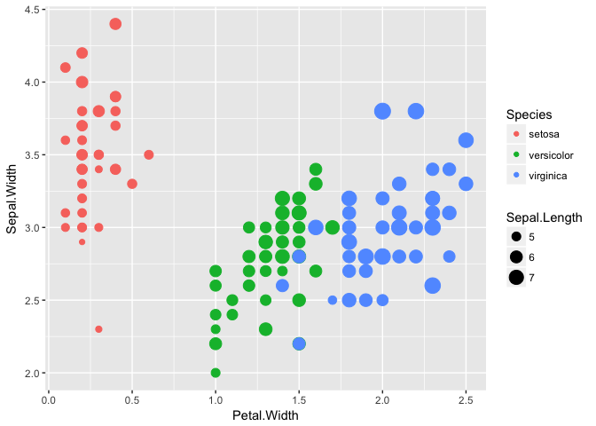

``` r
## Dot Chart equivalent
ggplot(meanaggg,aes(x=Group.2,y=x,color=Group.2)) + 
  geom_point()+coord_flip()+facet_wrap(~Group.1, ncol=1) 
```

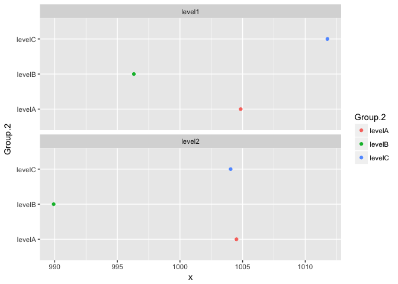

股票数据
--------

``` r
# Time Series Plotting
library(ggplot2)
library(xts)
library(dygraphs)
 
# Get IBM and Linkedin stock data from Yahoo Finance
ibm_url <- "http://real-chart.finance.yahoo.com/table.csv?s=IBM&a=07&b=24&c=2010&d=07&e=24&f=2015&g=d&ignore=.csv"
lnkd_url <- "http://real-chart.finance.yahoo.com/table.csv?s=LNKD&a=07&b=24&c=2010&d=07&e=24&f=2015&g=d&ignore=.csv"
 
yahoo.read <- function(url){
   dat <- read.table(url,header=TRUE,sep=",")
   df <- dat[,c(1,5)]
   df$Date <- as.Date(as.character(df$Date))
   return(df)}
 
ibm  <- yahoo.read(ibm_url)
lnkd2 <- yahoo.read(lnkd_url)

ggplot(ibm,aes(Date,Close)) + 
  geom_line(aes(color="ibm")) +
  geom_line(data=lnkd2,aes(color="lnkd2")) +
  labs(color="Legend") +
  scale_colour_manual("", breaks = c("ibm", "lnkd2"),
                          values = c("blue", "brown")) +
  ggtitle("Closing Stock Prices: IBM & Linkedin") + 
  theme(plot.title = element_text(lineheight=.7, face="bold"))
```

动起来

``` r
# Plot with the htmlwidget dygraphs
# dygraph() needs xts time series objects
ibm_xts <- xts(ibm$Close,order.by=ibm$Date,frequency=365)
lnkd_xts <- xts(lnkd2$Close,order.by=lnkd2$Date,frequency=365)
 
stocks <- cbind(ibm_xts,lnkd_xts)
 
dygraph(stocks,ylab="Close", 
        main="IBM and Linkedin Closing Stock Prices") %>%
  dySeries("..1",label="IBM") %>%
  dySeries("..2",label="LNKD") %>%
  dyOptions(colors = c("blue","brown")) %>%
  dyRangeSelector()
```
