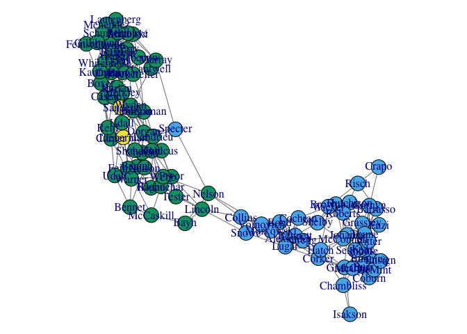

igraph
================
Dingchong
Friday, April 17, 2015

This is an R Markdown document. Markdown is a simple formatting syntax for authoring HTML, PDF, and MS Word documents. For more details on using R Markdown see <http://rmarkdown.rstudio.com>.

When you click the **Knit** button a document will be generated that includes both content as well as the output of any embedded R code chunks within the document. You can embed an R code chunk like this:

``` r
#??员??????投票?模?

setwd("/Users/dingchong/github/Data-Science-in-R/4.Vasualization")

library(spaceExt)
```

    ## Loading required package: limSolve

    ## Warning: package 'limSolve' was built under R version 3.2.5

    ## Loading required package: glasso

``` r
library(igraph)
```

    ## 
    ## Attaching package: 'igraph'

    ## The following objects are masked from 'package:stats':
    ## 
    ##     decompose, spectrum

    ## The following object is masked from 'package:base':
    ## 
    ##     union

``` r
load("senate.RData") #bilINfo?榘????荩?idlist??员???荩?投票??为??696???榘???110????员??
#?瞥?投票缺失?隙?????员
sel=which(!(colSums(is.na(voteMatrix))>100))  # 筛选??投票????na??????100???幕?员
partyD=as.numeric(idList[sel,5]=="D") #?????堑???D????员
partyI=as.numeric(idList[sel,5]=="ID" | idList[sel,5]=="I") #?????堑???I????ID????员

#??spaceExt??????
# A function to achieve covariance selection by glasso with EM, missing data is allowed
res=glasso.miss(voteMatrix[,sel],20,rho=0.1,penalize.diagonal=FALSE)
```

    ## [1] "Em step: 1"
    ## [1] "Em step: 2"
    ## [1] "Em step: 3"
    ## [1] "Em step: 4"
    ## [1] "Em step: 5"
    ## [1] "Em step: 6"
    ## [1] "Em Converge!"

``` r
#????偏????系??????
p=-res$wi
d=1/sqrt(diag(res$wi))
p=diag(d)%*%p%*%diag(d)
diag(p)=0

#igraph??????图模?汀???图
g=graph.adjacency((p>(0.055)),mode="undirected",diag=F)
V(g)$color=(partyD+2+partyI*2)
V(g)$label=idList[sel,3]
par(mar=c(0,0,0,0))
plot(g,layout=layout.fruchterman.reingold, edge.color=grey(0.5),vertex.size=10)
```



You can also embed plots, for example:


Note that the `echo = FALSE` parameter was added to the code chunk to prevent printing of the R code that generated the plot.
