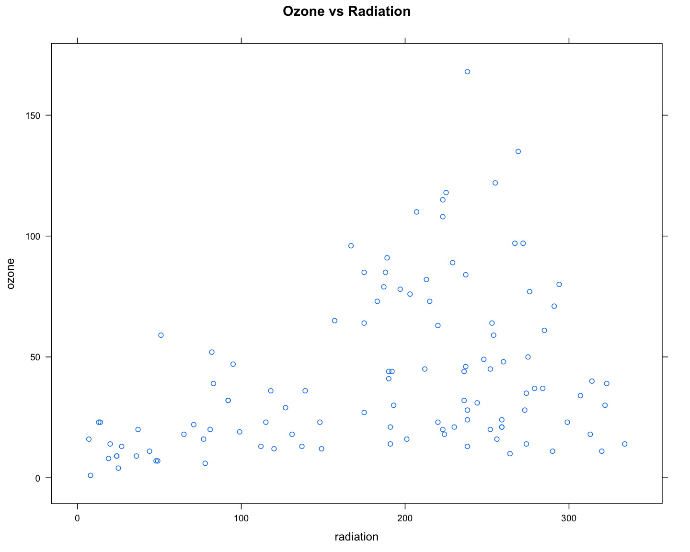
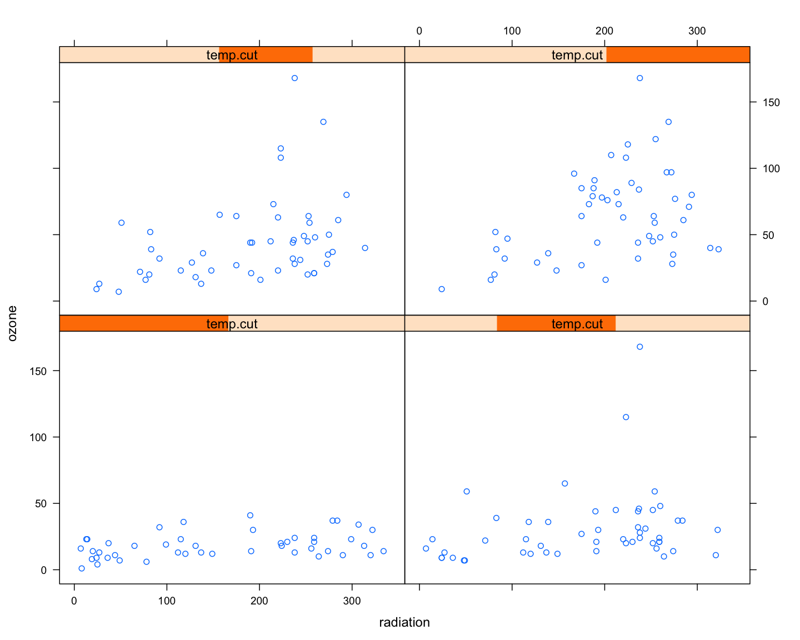
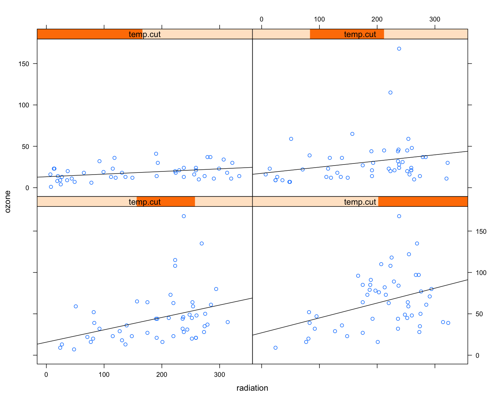
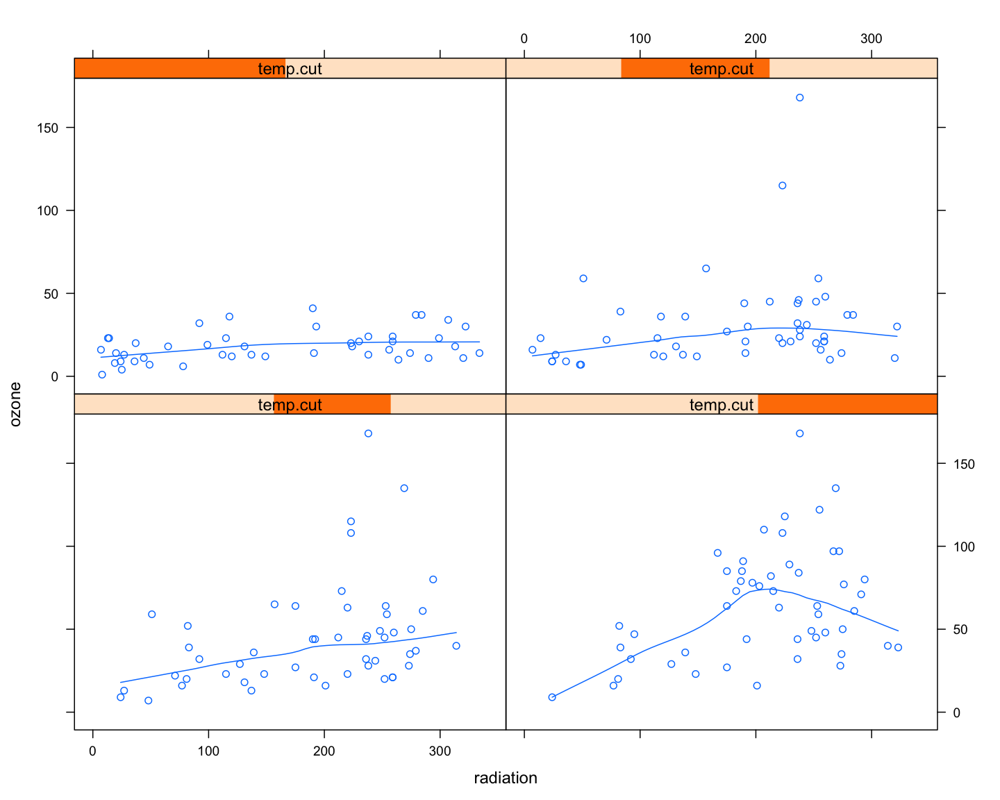
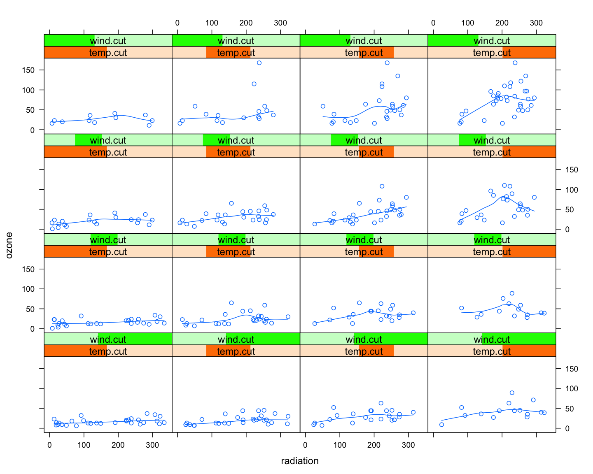
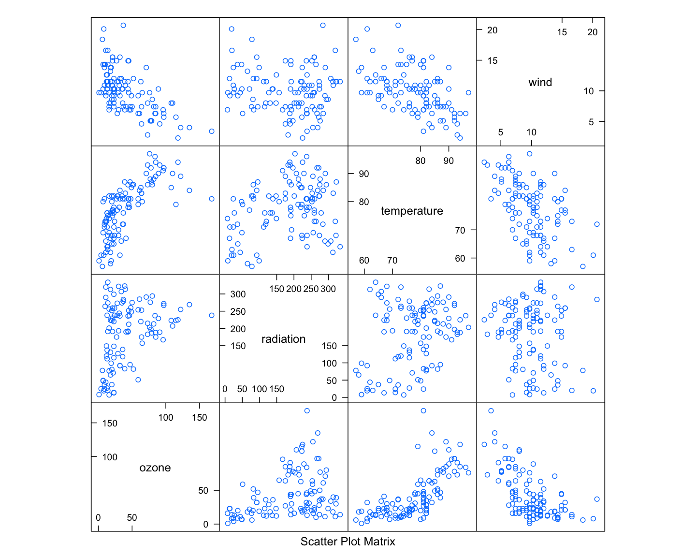
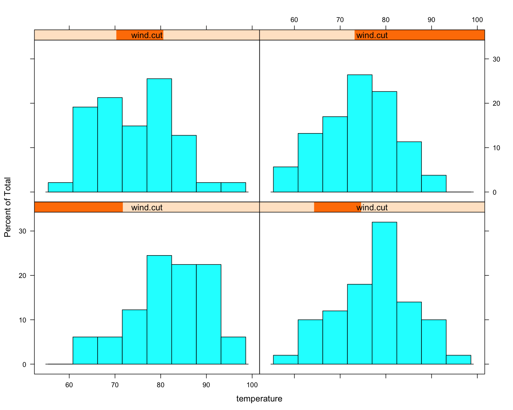

lattice包展示
================
dingchong
August 30, 2015

案例数据
--------

``` r
library( lattice)
data( "environmental")
# ?environmental
head( environmental)
```

      ozone radiation temperature wind
    1    41       190          67  7.4
    2    36       118          72  8.0
    3    12       149          74 12.6
    4    18       313          62 11.5
    5    23       299          65  8.6
    6    19        99          59 13.8

主函数xyplot
------------

``` r
# 和plot类似的功能，显示氧气浓度和辐射量的相关性
xyplot( ozone ~ radiation, data = environmental, main = ' Ozone vs Radiation')
```



加入第三个变量
--------------

连续变量分组有两种方式：完全切分和重叠切分。
作为condition variable时，有重叠的切分连续变量是有意义的。
先看看重叠切分函数equal.count：

``` r
equal.count(1:100,4 ) # overlap = 0 则无重复
```


    Data:
      [1]   1   2   3   4   5   6   7   8   9  10  11  12  13  14  15  16  17
     [18]  18  19  20  21  22  23  24  25  26  27  28  29  30  31  32  33  34
     [35]  35  36  37  38  39  40  41  42  43  44  45  46  47  48  49  50  51
     [52]  52  53  54  55  56  57  58  59  60  61  62  63  64  65  66  67  68
     [69]  69  70  71  72  73  74  75  76  77  78  79  80  81  82  83  84  85
     [86]  86  87  88  89  90  91  92  93  94  95  96  97  98  99 100

    Intervals:
       min max count
    1  0.5  40    40
    2 20.5  60    40
    3 40.5  80    40
    4 60.5 100    40

    Overlap between adjacent intervals:
    [1] 20 20 20

用equal.count划分温度区间

``` r
summary( environmental$temperature)
```

       Min. 1st Qu.  Median    Mean 3rd Qu.    Max. 
         57      71      79      78      84      97 

``` r
temp.cut = equal.count( environmental$temperature, 4 )
temp.cut # 
```


    Data:
      [1] 67 72 74 62 65 59 61 69 66 68 58 64 66 57 68 62 59 73 61 61 67 81 79
     [24] 76 82 90 87 82 77 72 65 73 76 84 85 81 83 83 88 92 92 89 73 81 80 81
     [47] 82 84 87 85 74 86 85 82 86 88 86 83 81 81 81 82 89 90 90 86 82 80 77
     [70] 79 76 78 78 77 72 79 81 86 97 94 96 94 91 92 93 93 87 84 80 78 75 73
     [93] 81 76 77 71 71 78 67 76 68 82 64 71 81 69 63 70 75 76 68

    Intervals:
      min max count
    1  56  76    46
    2  68  82    51
    3  76  86    51
    4  80  98    51

    Overlap between adjacent intervals:
    [1] 27 30 31

在研究氧气浓度和辐射量的时候，考虑不同温度的影响

``` r
xyplot( ozone ~ radiation | temp.cut, data = environmental )
```



``` r
xyplot( ozone ~ radiation | temp.cut, data = environmental , 
        layout = c(2,2), as.table = T )
```


``` r
# 线性拟合
xyplot( ozone ~ radiation | temp.cut, data = environmental , 
        layout = c(2,2),  as.table = T,
        panel = function(x,y) {
          panel.xyplot(x,y)
          fit = lm( y ~ x )
          panel.abline( fit )
        } )
```



``` r
# 移动平滑拟合
xyplot( ozone ~ radiation | temp.cut, data = environmental ,
        layout = c(2,2),  as.table = T,
        panel = function(x,y) {
          panel.xyplot(x,y)
          panel.loess(x,y)
        } )
```



xyplot很适合表现在第三变量condition variable存在的情况下两变量之间的相关关系
----------------------------------------------------------------------------

更多的影响因子
--------------

+风速

``` r
head( environmental,4 )
```

      ozone radiation temperature wind
    1    41       190          67  7.4
    2    36       118          72  8.0
    3    12       149          74 12.6
    4    18       313          62 11.5

``` r
wind.cut = equal.count( environmental$wind , 4 )
wind.cut
```


    Data:
      [1]  7.4  8.0 12.6 11.5  8.6 13.8 20.1  9.7  9.2 10.9 13.2 11.5 12.0 18.4
     [15] 11.5  9.7  9.7 16.6  9.7 12.0 12.0 14.9  5.7  7.4  9.7 13.8 11.5  8.0
     [29] 14.9 20.7  9.2 11.5 10.3  4.0  9.2  9.2  4.6 10.9  5.1  6.3  5.7  7.4
     [43] 14.3 14.9 14.3  6.9 10.3  6.3  5.1 11.5  6.9  8.6  8.0  8.6 12.0  7.4
     [57]  7.4  7.4  9.2  6.9 13.8  7.4  4.0 10.3  8.0 11.5 11.5  9.7 10.3  6.3
     [71]  7.4 10.9 10.3 15.5 14.3  9.7  3.4  8.0  9.7  2.3  6.3  6.3  6.9  5.1
     [85]  2.8  4.6  7.4 15.5 10.9 10.3 10.9  9.7 14.9 15.5  6.3 10.9 11.5  6.9
     [99] 13.8 10.3 10.3  8.0 12.6  9.2 10.3 10.3 16.6  6.9 14.3  8.0 11.5

    Intervals:
       min  max count
    1  2.0  9.4    49
    2  6.7 10.6    50
    3  8.9 12.8    47
    4 10.1 20.9    53

    Overlap between adjacent intervals:
    [1] 31 25 32

``` r
xyplot( ozone ~ radiation | temp.cut*wind.cut, data = environmental , as.table = T,
        panel = function(x,y) {
          panel.xyplot(x,y)
          panel.loess(x,y)
        } )
```



其他类型的图例
--------------

``` r
splom( ~ environmental) # 散点图矩阵，类似plot/pairs矩阵
```



``` r
histogram( ~ temperature | wind.cut , data = environmental)
```


