exploratory data analysis 3
================
Dingchong
Friday, March 20, 2015

WEEK 3
------

-   1.Hierarchical Clustering
-   2.K-Means Clustering
-   3.Dimensioni Reduction

### 1.Hierarchical Clustering

Distance or similarity - Continuous - euclidean distance - Continuous - correlation similarity - Binary - manhattan distance

``` r
set.seed(1234)
par( mar = c(5,5,5,5) )
x = rnorm( 12, mean = rep(1:3, each =4 ), sd = 0.2 )
y = rnorm( 12, mean = rep(c(1,2,1), each = 4), sd = 0.2)
plot( x, y, col = "blue", pch = 19, cex = 2)
text( x + 0.05, y+ 0.05, labels = as.character(1:12))
```

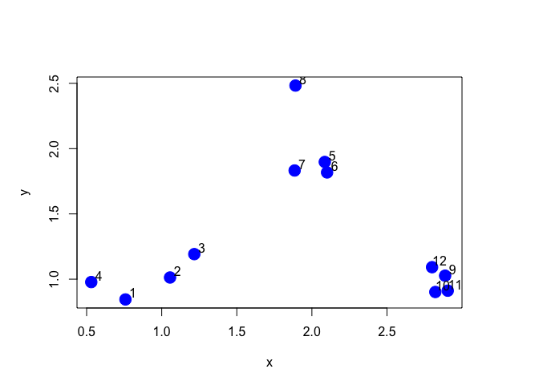

``` r
# hierarchical clusting - dist
dataFrame = data.frame( x=x, y=y )
distxy = dist(dataFrame, method ="euclidean" )
hClustering = hclust( distxy )
plot( hClustering )
```

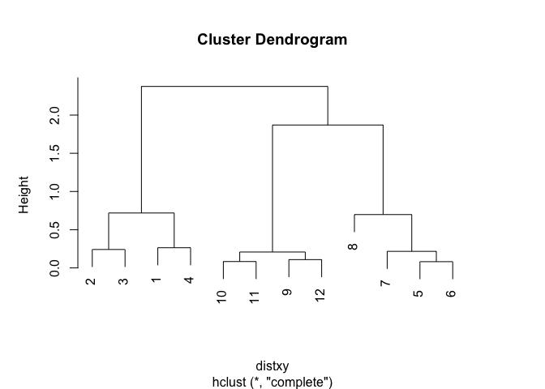

Prettier dendrograms

``` r
myplclust = function( hclust, lab = hclust$labels, lab.col = rep(1, length(hclust$labels)), 
      hang = 0.1, ...) {
  ## Eva KF Chan 2009
  y = rep(hclust$height , 2 )
  x = as.numeric( hclust$merge )
  y = y[ which(x < 0 )]
  x = x[ which(x < 0 )]
  x = abs(x)
  y = y[ order(x)]
  x = x[ order(x)]
  plot( hclust, labels = FALSE, hang = hang, ... )
  text( x = x, y = y[hclust$order] - ( max(hclust$height )*hang ), 
        labels = lab[ hclust$order], col = lab.col[ hclust$order], srt = 90, 
        adj = c(1, 0.5), xpd = NA, ... )
}

myplclust( hClustering, lab = rep(1:3, each =4), lab.col = rep(1:3, each =4 ))
```

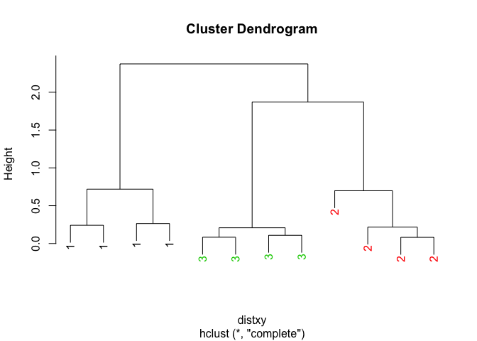

Even Prettier dendrograms

``` r
# prepare hierarchical cluster
hc = hclust(dist(mtcars))

# very simple dendrogram
plot(hc)
```

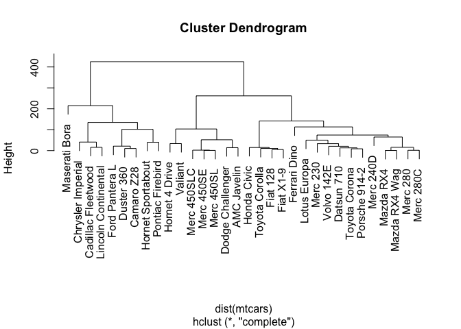

``` r
# labels at the same level
plot(hc, hang = -1)
```

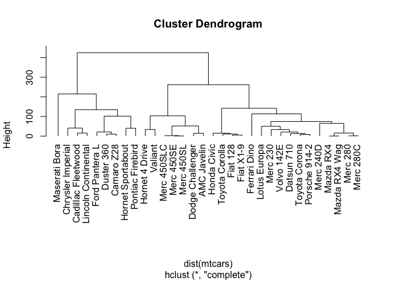

``` r
# set background color
op = par(bg = "#DDE3CA")
# plot dendrogram
plot(hc, col = "#487AA1", col.main = "#45ADA8", col.lab = "#7C8071",
     col.axis = "#F38630", lwd = 3, lty = 3, sub = '', hang = -1, axes = FALSE)
# add axis
axis(side = 2, at = seq(0, 400, 100), col = "#F38630",
     labels = FALSE, lwd = 2)
# add text in margin
mtext(seq(0, 400, 100), side = 2, at = seq(0, 400, 100),
      line = 1, col = "#A38630", las = 2)
```

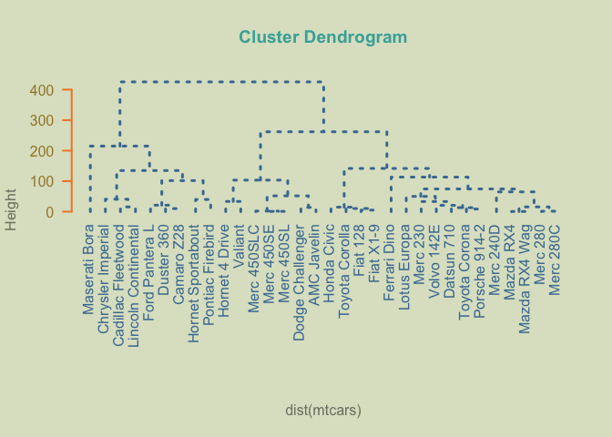

``` r
dev.off()
```

    ## null device 
    ##           1

``` r
# using dendrogram objects
hcd = as.dendrogram(hc)

# alternative way to get a dendrogram
op = par(mfrow = c(2, 1))
plot(hcd)

# triangular dendrogram
plot(hcd, type = "triangle")


dev.off()
```

    ## null device 
    ##           1

``` r
# vector of colors
labelColors = c("#CDB380", "#036564", "#EB6841", "#EDC951")

# cut dendrogram in 4 clusters
clusMember = cutree(hc, 4)

# function to get color labels
colLab <- function(n) {
  if (is.leaf(n)) {
    a <- attributes(n)
    labCol <- labelColors[clusMember[which(names(clusMember) == a$label)]]
    attr(n, "nodePar") <- c(a$nodePar, lab.col = labCol)
  }
  n
}

# using dendrapply
clusDendro = dendrapply(hcd, colLab)

# make plot
plot(clusDendro, main = "Cool Dendrogram", type = "triangle")


# load package ape;
# remember to install it: install.packages("ape")
library(ape)
```

    ## Warning: package 'ape' was built under R version 3.2.5

``` r
# plot basic tree
plot(as.phylo(hc), cex = 0.9, label.offset = 1)
# cladogram
plot(as.phylo(hc), type="cladogram", cex = 0.9, label.offset = 1)


# vector of colors
mypal = c("#556270", "#4ECDC4", "#1B676B", "#FF6B6B", "#C44D58")
# cutting dendrogram in 5 clusters
clus5 = cutree(hc, 5)
# plot
op = par(bg="#E8DDCB")
# Size reflects miles per gallon
plot(as.phylo(hc), type = "fan", tip.color = mypal[clus5], label.offset = 1,
cex = log(mtcars$mpg,10), col = "red")

dev.off()
```

    ## null device 
    ##           1

``` r
# local saved
source("http://addictedtor.free.fr/packages/A2R/lastVersion/R/code.R")

# colored dendrogram
op = par(bg = "#EFEFEF")
A2Rplot(hc, k = 3, boxes = FALSE, col.up = "gray50",
        col.down = c("#FF6B6B", "#4ECDC4", "#556270"))
```

### 2.K-Means Clustering

#### Can we find things that are close together ?

-   How do we define close ?
-   How do we group things ?
-   How do we visualize the grouping ?
-   How do we interpret the grouping ?

#### K-means clustering

-   Fix number of clusters need to be given first

``` r
# a data set 
set.seed(1234)
par( mar = c(0,0,0,0))
x = rnorm( 12, mean = rep(1:3, each = 4), sd = 0.2 )
y = rnorm(12, mean = rep(c(1,2,1), each =4 ), sd = 0.2 )
plot( x, y , col = "blue", pch = 19, cex =2 )
text( x + 0.05, y + 0.05, labels = as.character( 1: 12 ))
```

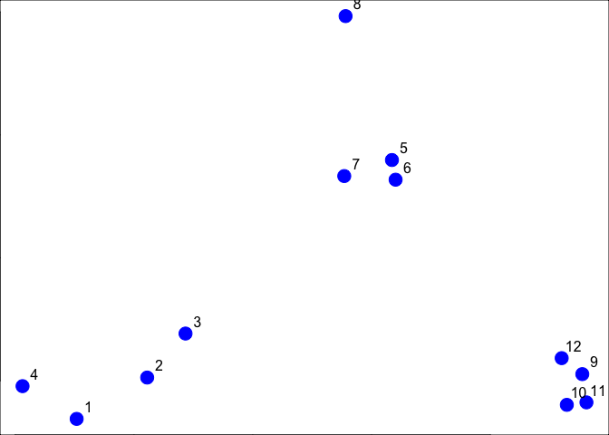

``` r
# use k-means
dataFrame = data.frame( x, y)
kmeansObj = kmeans( dataFrame, centers =3 )
names(kmeansObj )
```

    ## [1] "cluster"      "centers"      "totss"        "withinss"    
    ## [5] "tot.withinss" "betweenss"    "size"         "iter"        
    ## [9] "ifault"

``` r
kmeansObj$cluster
```

    ##  [1] 3 3 3 3 1 1 1 1 2 2 2 2

``` r
# plot of 2 var k-means
par( mar = rep( 0.2, 4))
plot( x, y , col = kmeansObj$cluster, pch = 19, cex =2 )
points( kmeansObj$centers, col = 1:3 , pch = 3, cex = 3, lwd =3 )
```

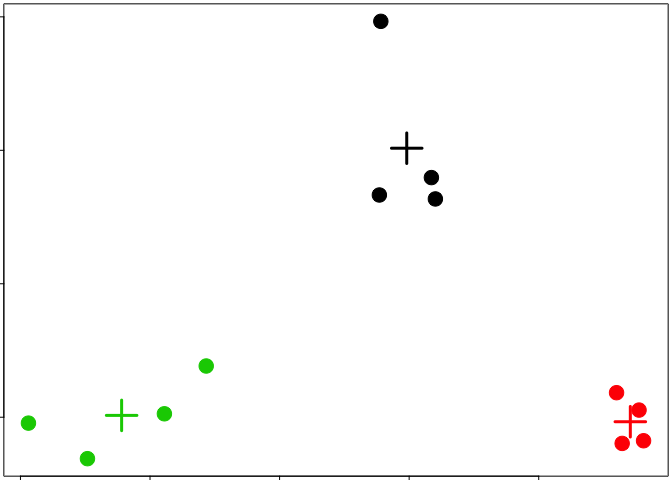

### 3.Dimension Reduction

Principla Components Analysis and Singular value decomposition

``` r
set.seed(1234)

dataMatrix = matrix( rnorm(400), nrow = 40 )
image( 1:10, 1:40, t(dataMatrix)[, nrow(dataMatrix):1 ])
```

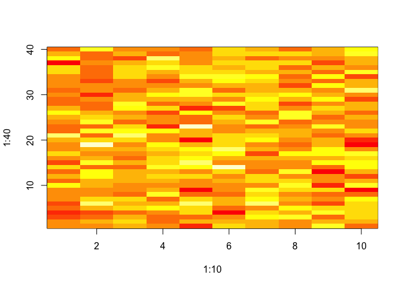

``` r
heatmap( dataMatrix)
```

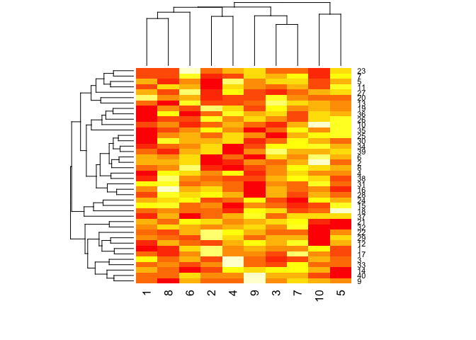

``` r
# add some pattern 
for ( i in 1:40 ) {
  # flip a coin
  coinFlip = rbinom( 1, size =1, prob = 0.5 )
  # if coin is heads add a common pattern to that row
  if ( coinFlip ) {
    dataMatrix[i, ] = dataMatrix[i,] + rep(c(0,3), each = 5 )
  }
}

par( mar = rep( 4, 4))
image( 1:10, 1:40, t(dataMatrix)[, nrow(dataMatrix):1 ] )
```

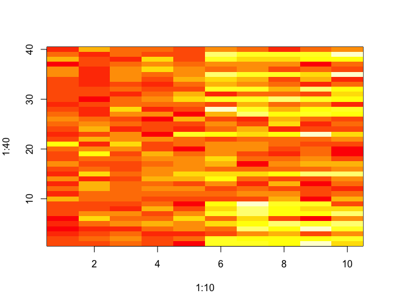

``` r
heatmap( dataMatrix)
```

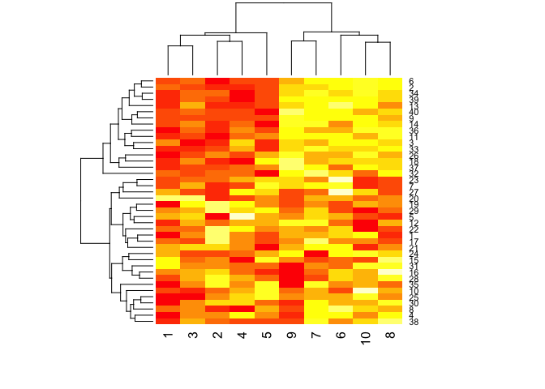

``` r
# patterns in rows and columns 

hh = hclust( dist(dataMatrix))
dataMatrixOrdered = dataMatrix[ hh$order, ]
par( mfrow = c(1,3))
image( t(dataMatrixOrdered)[, nrow(dataMatrixOrdered):1 ])
plot( rowMeans( dataMatrixOrdered), 40:1, ,  xlab = "Row Mean", ylab = "Row", pch = 19 )
plot( colMeans( dataMatrixOrdered), xlab = "Column", ylab = "Column Mean", pch = 19 )
```

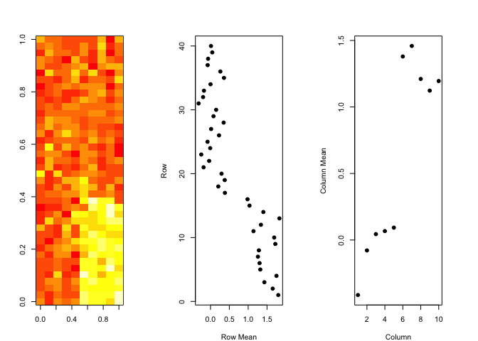

???????⣺ 1.???ɷַ????????ر?��???ֽ??ɲ????صĶ?��?????٣???�� 2.SVD????????ά,????ѹ??

Components of the SVD - u and v

``` r
svd1 = svd( scale(dataMatrixOrdered))
str( svd1 )
```

    ## List of 3
    ##  $ d: num [1:10] 12.16 7.44 6.77 6.37 5.65 ...
    ##  $ u: num [1:40, 1:10] -0.1264 -0.1134 -0.1662 -0.1399 -0.0668 ...
    ##  $ v: num [1:10, 1:10] -0.02286 -0.25666 0.07483 -0.06354 -0.00534 ...

``` r
par( mfrow = c(1,3))
image( t(dataMatrixOrdered)[, nrow(dataMatrixOrdered):1 ])
plot( svd1$u[,1], 40:1, , xlab ="Row", ylab = "First left singular vector", pch = 19 )
plot( svd1$v[,1], xlab = "Column", ylab = "First right singular vector", pch = 19 )
```

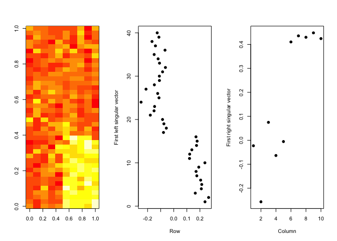

????????ֵ?ֽ???u??v??ʵ?ǰ??к??е???????ȡ??��

Components of the SVD - Variance explained

``` r
par( mfrow = c(1,2))
plot( svd1$d, xlab ="Column", ylab ="Singular value", pch = 19 )
plot( svd1$d^2/sum( svd1$d^2), xlab = "Column", ylab = "Prop. of variance explained", pch = 19)
```

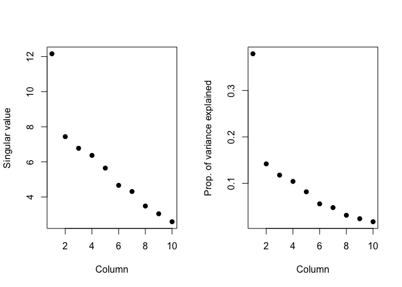

Relationship to principal components ????????һ???¶?

``` r
svd1 = svd( scale(dataMatrixOrdered))
pca1 = prcomp( dataMatrixOrdered, scale = T )
plot( pca1$rotation[,1], svd1$v[,1], pch = 19, xlab= "Principal Component 1", 
      ylab ="Right Singular Vector 1")
abline( c(0,1))
```

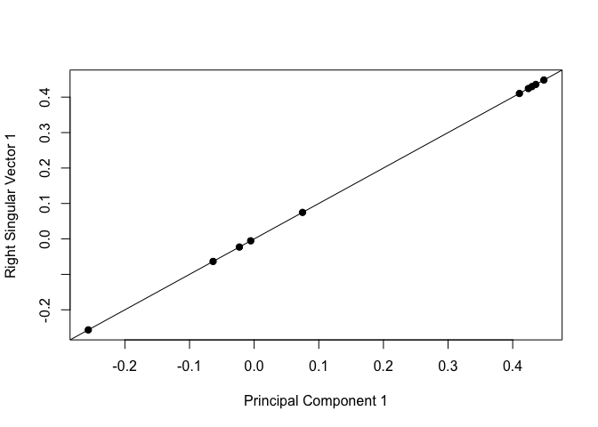

Components of the SVD - variance explained

``` r
constantMatrix = dataMatrixOrdered * 0
for ( i in 1:dim(dataMatrixOrdered)[1]) {
  constantMatrix[i,] = rep(c(0,1), each = 5)
}
svd1 = svd( constantMatrix )
par( mfrow = c(1,3))
image( t(constantMatrix)[, nrow( constantMatrix):1 ])
plot( svd1$d, xlab ="Column", ylab ="Singular value", pch = 19 )
plot( svd1$d^2/sum(svd1$d^2), xlab = "Column", ylab = "Prop. of varance explained", pch = 19)
```

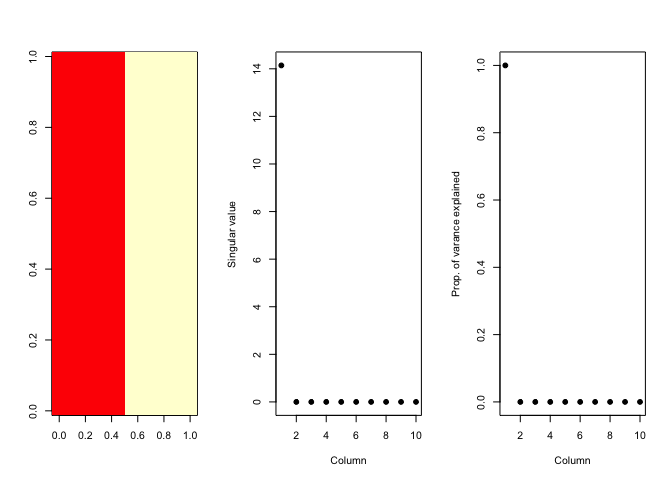

What if we add a second pattern

``` r
set.seed(678910)
for ( i in 1:40) {
  # flip a coin 
  coinFlip1 = rbinom(1, size =1, prob = 0.5)
  coinFlip2 = rbinom(1, size = 1, prob = 0.5)
  # if coin is heads add a common pattern to that row 
  if ( coinFlip1) {
    dataMatrix[i, ] = dataMatrix[i,] + rep(c(0,5), each = 5 )
  }
  if ( coinFlip2) {
    dataMatrix[i, ] = dataMatrix[i, ] + rep(c(0,5), 5)
  }
}
hh = hclust( dist(dataMatrix))
dataMatrixOrdered = dataMatrix[ hh$order,]
```

singular value decomposition - true patterns

``` r
svd2 = svd( scale(dataMatrixOrdered))
par( mfrow = c(1,3))
image( t(dataMatrixOrdered)[, nrow(dataMatrixOrdered):1 ])
plot( rep(c(0,1), each = 5), pch = 19, xlab ="Column", ylab = "Pattern 1 ")
plot( rep(c(0,1), 5), pch = 15, xlab ="Column", ylab ="Pattern 2")
```

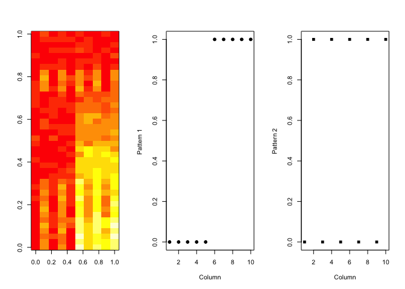

can you come up with an algorithm that can pick up on the 2 separate patterns that are buried within the data ? That is SVD for .

Missing values make SVD and PCA dont work see library(impute) function : impute.knn
